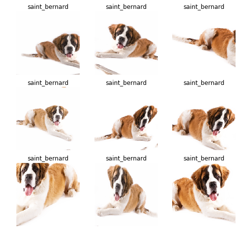
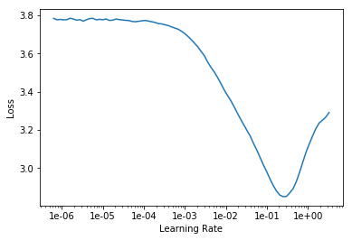
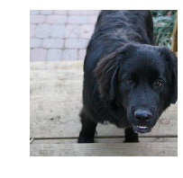
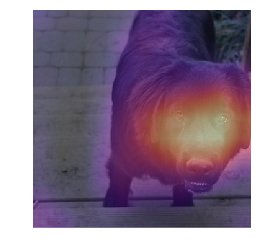

# Convolutions and Kernels

## Data Augmentation


```
%reload_ext autoreload
%autoreload 2
%matplotlib inline

from fastai.vision import *
```


```
doc(get_transforms)
```


<h4 id="get_transforms" class="doc_header"><code>get_transforms</code><a href="https://github.com/fastai/fastai/blob/master/fastai/vision/transform.py#L307" class="source_link" style="float:right">[source]</a><a class="source_link" data-toggle="collapse" data-target="#get_transforms-pytest" style="float:right; padding-right:10px">[test]</a></h4><blockquote><p><code>get_transforms</code>(<strong><code>do_flip</code></strong>:<code>bool</code>=<strong><em><code>True</code></em></strong>, <strong><code>flip_vert</code></strong>:<code>bool</code>=<strong><em><code>False</code></em></strong>, <strong><code>max_rotate</code></strong>:<code>float</code>=<strong><em><code>10.0</code></em></strong>, <strong><code>max_zoom</code></strong>:<code>float</code>=<strong><em><code>1.1</code></em></strong>, <strong><code>max_lighting</code></strong>:<code>float</code>=<strong><em><code>0.2</code></em></strong>, <strong><code>max_warp</code></strong>:<code>float</code>=<strong><em><code>0.2</code></em></strong>, <strong><code>p_affine</code></strong>:<code>float</code>=<strong><em><code>0.75</code></em></strong>, <strong><code>p_lighting</code></strong>:<code>float</code>=<strong><em><code>0.75</code></em></strong>, <strong><code>xtra_tfms</code></strong>:<code>Optional</code>[<code>Collection</code>[<a href="https://docs.fast.ai/vision.image.html#Transform"><code>Transform</code></a>]]=<strong><em><code>None</code></em></strong>) → <code>Collection</code>[<a href="https://docs.fast.ai/vision.image.html#Transform"><code>Transform</code></a>]</p>
</blockquote>
<div class="collapse" id="get_transforms-pytest"><div class="card card-body pytest_card"><a type="button" data-toggle="collapse" data-target="#get_transforms-pytest" class="close" aria-label="Close"><span aria-hidden="true">&times;</span></a><p>Tests found for <code>get_transforms</code>:</p><ul><li><code>pytest -sv tests/test_vision_data.py::test_image_to_image_different_tfms</code> <a href="https://github.com/fastai/fastai/blob/master/tests/test_vision_data.py#L328" class="source_link" style="float:right">[source]</a></li><li><code>pytest -sv tests/test_vision_data.py::test_image_to_image_different_y_size</code> <a href="https://github.com/fastai/fastai/blob/master/tests/test_vision_data.py#L313" class="source_link" style="float:right">[source]</a></li></ul><p>To run tests please refer to this <a href="/dev/test.html#quick-guide">guide</a>.</p></div></div><p>Utility func to easily create a list of flip, rotate, <a href="https://docs.fast.ai/vision.transform.html#_zoom"><code>zoom</code></a>, warp, lighting transforms.</p>
<p><a href="https://docs.fast.ai/vision.transform.html#get_transforms" target="_blank" rel="noreferrer noopener">Show in docs</a></p>


Use transformations wisely, depending on the data.

* reflections (padding) works better in most cases


```
bs = 64
path = untar_data(URLs.PETS)/'images'
```


```
tfms = get_transforms(max_rotate=20, max_zoom=1.3, max_lighting=0.4, max_warp=0.4, p_affine=1., p_lighting=1.)
```


```
src = ImageList.from_folder(path).split_by_rand_pct(0.2, seed=2)
```


```
def get_data(size, bs, padding_mode='reflection'):
    return (src.label_from_re(r'([^/]+)_\d+.jpg$')
           .transform(tfms, size=size, padding_mode=padding_mode)
           .databunch(bs=bs).normalize(imagenet_stats))
```


```
data = get_data(224, bs, 'zeros')
```


```
def _plot(i,j,ax):
    x, y = data.train_ds[3]
    x.show(ax, y=y)

plot_multi(_plot, 3, 3, figsize=(8,8))
```


```
data = get_data(224, bs)
```


```
plot_multi(_plot, 3, 3, figsize=(8,8))
```





```
data
```


    ImageDataBunch;
    
    Train: LabelList (5912 items)
    x: ImageList
    Image (3, 224, 224),Image (3, 224, 224),Image (3, 224, 224),Image (3, 224, 224),Image (3, 224, 224)
    y: CategoryList
    saint_bernard,Siamese,wheaten_terrier,saint_bernard,Birman
    Path: /root/.fastai/data/oxford-iiit-pet/images;
    
    Valid: LabelList (1478 items)
    x: ImageList
    Image (3, 224, 224),Image (3, 224, 224),Image (3, 224, 224),Image (3, 224, 224),Image (3, 224, 224)
    y: CategoryList
    newfoundland,great_pyrenees,miniature_pinscher,miniature_pinscher,Abyssinian
    Path: /root/.fastai/data/oxford-iiit-pet/images;
    
    Test: None


## *Training*

* Using resnet34


```
gc.collect()
learn = cnn_learner(data, models.resnet34, metrics=error_rate, bn_final=True)
```


```
learn.lr_find()
```


    LR Finder is complete, type {learner_name}.recorder.plot() to see the graph.


```
learn.recorder.plot()
```





```
learn.fit_one_cycle(3, slice(1e-2), pct_start=0.8)
```


<table border="1" class="dataframe">
  <thead>
    <tr style="text-align: left;">
      <th>epoch</th>
      <th>train_loss</th>
      <th>valid_loss</th>
      <th>error_rate</th>
      <th>time</th>
    </tr>
  </thead>
  <tbody>
    <tr>
      <td>0</td>
      <td>2.308835</td>
      <td>1.059744</td>
      <td>0.250338</td>
      <td>01:22</td>
    </tr>
    <tr>
      <td>1</td>
      <td>1.341733</td>
      <td>0.374047</td>
      <td>0.101489</td>
      <td>01:21</td>
    </tr>
    <tr>
      <td>2</td>
      <td>0.839918</td>
      <td>0.291288</td>
      <td>0.084574</td>
      <td>01:20</td>
    </tr>
  </tbody>
</table>


```
learn.save('phase-1')
```


```
learn.load('phase-1');
```


```
learn.unfreeze() # Use unfreeze whenever we want the layers to be trainable again
```


```
learn.lr_find()
```


    LR Finder is complete, type {learner_name}.recorder.plot() to see the graph.


```
learn.recorder.plot()
```


```
learn.fit_one_cycle(2, max_lr=slice(1e-04,1e-2/5), pct_start=0.8)
```


<table border="1" class="dataframe">
  <thead>
    <tr style="text-align: left;">
      <th>epoch</th>
      <th>train_loss</th>
      <th>valid_loss</th>
      <th>error_rate</th>
      <th>time</th>
    </tr>
  </thead>
  <tbody>
    <tr>
      <td>0</td>
      <td>0.745683</td>
      <td>0.496205</td>
      <td>0.129905</td>
      <td>01:25</td>
    </tr>
    <tr>
      <td>1</td>
      <td>0.806681</td>
      <td>0.404330</td>
      <td>0.108931</td>
      <td>01:24</td>
    </tr>
  </tbody>
</table>


```
learn.save('phase-2')
```

Increase the size,


```
data = get_data(352,bs)
learn.data = data
```


```
learn.fit_one_cycle(2, max_lr=slice(1e-6,1e-4))
```


<table border="1" class="dataframe">
  <thead>
    <tr style="text-align: left;">
      <th>epoch</th>
      <th>train_loss</th>
      <th>valid_loss</th>
      <th>error_rate</th>
      <th>time</th>
    </tr>
  </thead>
  <tbody>
    <tr>
      <td>0</td>
      <td>0.746144</td>
      <td>0.337958</td>
      <td>0.079161</td>
      <td>02:28</td>
    </tr>
    <tr>
      <td>1</td>
      <td>0.668097</td>
      <td>0.329470</td>
      <td>0.070365</td>
      <td>02:26</td>
    </tr>
  </tbody>
</table>


```
learn.save('352')
```

## Kernels

- http://setosa.io/ev/image-kernels/
- A convolutional kernel or filter
- At the edge, we can pad the image; or else we get a black edge
- We can pad with 0s along the border to give the same dimension output that we stated with
- We can use reflection padding as well
- A convolution is just a matrix multiplication with tied weights
- Tied weights refer to the fixed weights in the kernels/filter
-  Each layer is a convolution; output of one convolution is a channel
- We increase the number of channels as we go deeper into the network
- To avoid our memory going out of control, we use a larger stride i.e. >1
- Stride is the amount by which we slide over the inputs
- We can have a stride of 2 and increase the number of filters like 16 to 32
- We often use larger kernels for the first layer (?)


```
data = get_data(352, 16)
```


```
learn = cnn_learner(data, models.resnet34, metrics=error_rate, bn_final=True)
learn.load('352');
```


```
idx = 0
x, y = data.valid_ds[idx]
x.show()
data.valid_ds.y[idx]
```


    Category newfoundland





We can also define our manual convolutional kernels. Here lets define a kernel to detect bottom-right 


```
k = tensor([
          [0., -5/3, 1],
          [-5/3, -5/3,1],
          [1., 1, 1]  
]).expand(1,3,3,3)/6
```

`.expand()` copies it for three channels. The 1 indicates one 4-d tensor.


```
k
```


    tensor([[[[ 0.0000, -0.2778,  0.1667],
              [-0.2778, -0.2778,  0.1667],
              [ 0.1667,  0.1667,  0.1667]],
    
             [[ 0.0000, -0.2778,  0.1667],
              [-0.2778, -0.2778,  0.1667],
              [ 0.1667,  0.1667,  0.1667]],
    
             [[ 0.0000, -0.2778,  0.1667],
              [-0.2778, -0.2778,  0.1667],
              [ 0.1667,  0.1667,  0.1667]]]])


```
k.size()
```


    torch.Size([1, 3, 3, 3])


```
t = data.valid_ds[0][0].data; t.shape
```


    torch.Size([3, 352, 352])


```
t[None].shape
```


    torch.Size([1, 3, 352, 352])


```
edge = F.conv2d(t[None], k)
```


```
show_image(edge[0], figsize=(5,5));
```


```
data.c
```


    37


```
learn.model
```


    Sequential(
      (0): Sequential(
        (0): Conv2d(3, 64, kernel_size=(7, 7), stride=(2, 2), padding=(3, 3), bias=False)
        (1): BatchNorm2d(64, eps=1e-05, momentum=0.1, affine=True, track_running_stats=True)
        (2): ReLU(inplace)
        (3): MaxPool2d(kernel_size=3, stride=2, padding=1, dilation=1, ceil_mode=False)
        (4): Sequential(
          (0): BasicBlock(
            (conv1): Conv2d(64, 64, kernel_size=(3, 3), stride=(1, 1), padding=(1, 1), bias=False)
            (bn1): BatchNorm2d(64, eps=1e-05, momentum=0.1, affine=True, track_running_stats=True)
            (relu): ReLU(inplace)
            (conv2): Conv2d(64, 64, kernel_size=(3, 3), stride=(1, 1), padding=(1, 1), bias=False)
            (bn2): BatchNorm2d(64, eps=1e-05, momentum=0.1, affine=True, track_running_stats=True)
          )
          (1): BasicBlock(
            (conv1): Conv2d(64, 64, kernel_size=(3, 3), stride=(1, 1), padding=(1, 1), bias=False)
            (bn1): BatchNorm2d(64, eps=1e-05, momentum=0.1, affine=True, track_running_stats=True)
            (relu): ReLU(inplace)
            (conv2): Conv2d(64, 64, kernel_size=(3, 3), stride=(1, 1), padding=(1, 1), bias=False)
            (bn2): BatchNorm2d(64, eps=1e-05, momentum=0.1, affine=True, track_running_stats=True)
          )
          (2): BasicBlock(
            (conv1): Conv2d(64, 64, kernel_size=(3, 3), stride=(1, 1), padding=(1, 1), bias=False)
            (bn1): BatchNorm2d(64, eps=1e-05, momentum=0.1, affine=True, track_running_stats=True)
            (relu): ReLU(inplace)
            (conv2): Conv2d(64, 64, kernel_size=(3, 3), stride=(1, 1), padding=(1, 1), bias=False)
            (bn2): BatchNorm2d(64, eps=1e-05, momentum=0.1, affine=True, track_running_stats=True)
          )
        )
        (5): Sequential(
          (0): BasicBlock(
            (conv1): Conv2d(64, 128, kernel_size=(3, 3), stride=(2, 2), padding=(1, 1), bias=False)
            (bn1): BatchNorm2d(128, eps=1e-05, momentum=0.1, affine=True, track_running_stats=True)
            (relu): ReLU(inplace)
            (conv2): Conv2d(128, 128, kernel_size=(3, 3), stride=(1, 1), padding=(1, 1), bias=False)
            (bn2): BatchNorm2d(128, eps=1e-05, momentum=0.1, affine=True, track_running_stats=True)
            (downsample): Sequential(
              (0): Conv2d(64, 128, kernel_size=(1, 1), stride=(2, 2), bias=False)
              (1): BatchNorm2d(128, eps=1e-05, momentum=0.1, affine=True, track_running_stats=True)
            )
          )
          (1): BasicBlock(
            (conv1): Conv2d(128, 128, kernel_size=(3, 3), stride=(1, 1), padding=(1, 1), bias=False)
            (bn1): BatchNorm2d(128, eps=1e-05, momentum=0.1, affine=True, track_running_stats=True)
            (relu): ReLU(inplace)
            (conv2): Conv2d(128, 128, kernel_size=(3, 3), stride=(1, 1), padding=(1, 1), bias=False)
            (bn2): BatchNorm2d(128, eps=1e-05, momentum=0.1, affine=True, track_running_stats=True)
          )
          (2): BasicBlock(
            (conv1): Conv2d(128, 128, kernel_size=(3, 3), stride=(1, 1), padding=(1, 1), bias=False)
            (bn1): BatchNorm2d(128, eps=1e-05, momentum=0.1, affine=True, track_running_stats=True)
            (relu): ReLU(inplace)
            (conv2): Conv2d(128, 128, kernel_size=(3, 3), stride=(1, 1), padding=(1, 1), bias=False)
            (bn2): BatchNorm2d(128, eps=1e-05, momentum=0.1, affine=True, track_running_stats=True)
          )
          (3): BasicBlock(
            (conv1): Conv2d(128, 128, kernel_size=(3, 3), stride=(1, 1), padding=(1, 1), bias=False)
            (bn1): BatchNorm2d(128, eps=1e-05, momentum=0.1, affine=True, track_running_stats=True)
            (relu): ReLU(inplace)
            (conv2): Conv2d(128, 128, kernel_size=(3, 3), stride=(1, 1), padding=(1, 1), bias=False)
            (bn2): BatchNorm2d(128, eps=1e-05, momentum=0.1, affine=True, track_running_stats=True)
          )
        )
        (6): Sequential(
          (0): BasicBlock(
            (conv1): Conv2d(128, 256, kernel_size=(3, 3), stride=(2, 2), padding=(1, 1), bias=False)
            (bn1): BatchNorm2d(256, eps=1e-05, momentum=0.1, affine=True, track_running_stats=True)
            (relu): ReLU(inplace)
            (conv2): Conv2d(256, 256, kernel_size=(3, 3), stride=(1, 1), padding=(1, 1), bias=False)
            (bn2): BatchNorm2d(256, eps=1e-05, momentum=0.1, affine=True, track_running_stats=True)
            (downsample): Sequential(
              (0): Conv2d(128, 256, kernel_size=(1, 1), stride=(2, 2), bias=False)
              (1): BatchNorm2d(256, eps=1e-05, momentum=0.1, affine=True, track_running_stats=True)
            )
          )
          (1): BasicBlock(
            (conv1): Conv2d(256, 256, kernel_size=(3, 3), stride=(1, 1), padding=(1, 1), bias=False)
            (bn1): BatchNorm2d(256, eps=1e-05, momentum=0.1, affine=True, track_running_stats=True)
            (relu): ReLU(inplace)
            (conv2): Conv2d(256, 256, kernel_size=(3, 3), stride=(1, 1), padding=(1, 1), bias=False)
            (bn2): BatchNorm2d(256, eps=1e-05, momentum=0.1, affine=True, track_running_stats=True)
          )
          (2): BasicBlock(
            (conv1): Conv2d(256, 256, kernel_size=(3, 3), stride=(1, 1), padding=(1, 1), bias=False)
            (bn1): BatchNorm2d(256, eps=1e-05, momentum=0.1, affine=True, track_running_stats=True)
            (relu): ReLU(inplace)
            (conv2): Conv2d(256, 256, kernel_size=(3, 3), stride=(1, 1), padding=(1, 1), bias=False)
            (bn2): BatchNorm2d(256, eps=1e-05, momentum=0.1, affine=True, track_running_stats=True)
          )
          (3): BasicBlock(
            (conv1): Conv2d(256, 256, kernel_size=(3, 3), stride=(1, 1), padding=(1, 1), bias=False)
            (bn1): BatchNorm2d(256, eps=1e-05, momentum=0.1, affine=True, track_running_stats=True)
            (relu): ReLU(inplace)
            (conv2): Conv2d(256, 256, kernel_size=(3, 3), stride=(1, 1), padding=(1, 1), bias=False)
            (bn2): BatchNorm2d(256, eps=1e-05, momentum=0.1, affine=True, track_running_stats=True)
          )
          (4): BasicBlock(
            (conv1): Conv2d(256, 256, kernel_size=(3, 3), stride=(1, 1), padding=(1, 1), bias=False)
            (bn1): BatchNorm2d(256, eps=1e-05, momentum=0.1, affine=True, track_running_stats=True)
            (relu): ReLU(inplace)
            (conv2): Conv2d(256, 256, kernel_size=(3, 3), stride=(1, 1), padding=(1, 1), bias=False)
            (bn2): BatchNorm2d(256, eps=1e-05, momentum=0.1, affine=True, track_running_stats=True)
          )
          (5): BasicBlock(
            (conv1): Conv2d(256, 256, kernel_size=(3, 3), stride=(1, 1), padding=(1, 1), bias=False)
            (bn1): BatchNorm2d(256, eps=1e-05, momentum=0.1, affine=True, track_running_stats=True)
            (relu): ReLU(inplace)
            (conv2): Conv2d(256, 256, kernel_size=(3, 3), stride=(1, 1), padding=(1, 1), bias=False)
            (bn2): BatchNorm2d(256, eps=1e-05, momentum=0.1, affine=True, track_running_stats=True)
          )
        )
        (7): Sequential(
          (0): BasicBlock(
            (conv1): Conv2d(256, 512, kernel_size=(3, 3), stride=(2, 2), padding=(1, 1), bias=False)
            (bn1): BatchNorm2d(512, eps=1e-05, momentum=0.1, affine=True, track_running_stats=True)
            (relu): ReLU(inplace)
            (conv2): Conv2d(512, 512, kernel_size=(3, 3), stride=(1, 1), padding=(1, 1), bias=False)
            (bn2): BatchNorm2d(512, eps=1e-05, momentum=0.1, affine=True, track_running_stats=True)
            (downsample): Sequential(
              (0): Conv2d(256, 512, kernel_size=(1, 1), stride=(2, 2), bias=False)
              (1): BatchNorm2d(512, eps=1e-05, momentum=0.1, affine=True, track_running_stats=True)
            )
          )
          (1): BasicBlock(
            (conv1): Conv2d(512, 512, kernel_size=(3, 3), stride=(1, 1), padding=(1, 1), bias=False)
            (bn1): BatchNorm2d(512, eps=1e-05, momentum=0.1, affine=True, track_running_stats=True)
            (relu): ReLU(inplace)
            (conv2): Conv2d(512, 512, kernel_size=(3, 3), stride=(1, 1), padding=(1, 1), bias=False)
            (bn2): BatchNorm2d(512, eps=1e-05, momentum=0.1, affine=True, track_running_stats=True)
          )
          (2): BasicBlock(
            (conv1): Conv2d(512, 512, kernel_size=(3, 3), stride=(1, 1), padding=(1, 1), bias=False)
            (bn1): BatchNorm2d(512, eps=1e-05, momentum=0.1, affine=True, track_running_stats=True)
            (relu): ReLU(inplace)
            (conv2): Conv2d(512, 512, kernel_size=(3, 3), stride=(1, 1), padding=(1, 1), bias=False)
            (bn2): BatchNorm2d(512, eps=1e-05, momentum=0.1, affine=True, track_running_stats=True)
          )
        )
      )
      (1): Sequential(
        (0): AdaptiveConcatPool2d(
          (ap): AdaptiveAvgPool2d(output_size=1)
          (mp): AdaptiveMaxPool2d(output_size=1)
        )
        (1): Flatten()
        (2): BatchNorm1d(1024, eps=1e-05, momentum=0.1, affine=True, track_running_stats=True)
        (3): Dropout(p=0.25)
        (4): Linear(in_features=1024, out_features=512, bias=True)
        (5): ReLU(inplace)
        (6): BatchNorm1d(512, eps=1e-05, momentum=0.1, affine=True, track_running_stats=True)
        (7): Dropout(p=0.5)
        (8): Linear(in_features=512, out_features=37, bias=True)
        (9): BatchNorm1d(37, eps=1e-05, momentum=0.01, affine=True, track_running_stats=True)
      )
    )


```
learn.summary()
```


    Sequential
    ======================================================================
    Layer (type)         Output Shape         Param #    Trainable 
    ======================================================================
    Conv2d               [64, 176, 176]       9,408      False     
    ______________________________________________________________________
    BatchNorm2d          [64, 176, 176]       128        True      
    ______________________________________________________________________
    ReLU                 [64, 176, 176]       0          False     
    ______________________________________________________________________
    MaxPool2d            [64, 88, 88]         0          False     
    ______________________________________________________________________
    Conv2d               [64, 88, 88]         36,864     False     
    ______________________________________________________________________
    BatchNorm2d          [64, 88, 88]         128        True      
    ______________________________________________________________________
    ReLU                 [64, 88, 88]         0          False     
    ______________________________________________________________________
    Conv2d               [64, 88, 88]         36,864     False     
    ______________________________________________________________________
    BatchNorm2d          [64, 88, 88]         128        True      
    ______________________________________________________________________
    Conv2d               [64, 88, 88]         36,864     False     
    ______________________________________________________________________
    BatchNorm2d          [64, 88, 88]         128        True      
    ______________________________________________________________________
    ReLU                 [64, 88, 88]         0          False     
    ______________________________________________________________________
    Conv2d               [64, 88, 88]         36,864     False     
    ______________________________________________________________________
    BatchNorm2d          [64, 88, 88]         128        True      
    ______________________________________________________________________
    Conv2d               [64, 88, 88]         36,864     False     
    ______________________________________________________________________
    BatchNorm2d          [64, 88, 88]         128        True      
    ______________________________________________________________________
    ReLU                 [64, 88, 88]         0          False     
    ______________________________________________________________________
    Conv2d               [64, 88, 88]         36,864     False     
    ______________________________________________________________________
    BatchNorm2d          [64, 88, 88]         128        True      
    ______________________________________________________________________
    Conv2d               [128, 44, 44]        73,728     False     
    ______________________________________________________________________
    BatchNorm2d          [128, 44, 44]        256        True      
    ______________________________________________________________________
    ReLU                 [128, 44, 44]        0          False     
    ______________________________________________________________________
    Conv2d               [128, 44, 44]        147,456    False     
    ______________________________________________________________________
    BatchNorm2d          [128, 44, 44]        256        True      
    ______________________________________________________________________
    Conv2d               [128, 44, 44]        8,192      False     
    ______________________________________________________________________
    BatchNorm2d          [128, 44, 44]        256        True      
    ______________________________________________________________________
    Conv2d               [128, 44, 44]        147,456    False     
    ______________________________________________________________________
    BatchNorm2d          [128, 44, 44]        256        True      
    ______________________________________________________________________
    ReLU                 [128, 44, 44]        0          False     
    ______________________________________________________________________
    Conv2d               [128, 44, 44]        147,456    False     
    ______________________________________________________________________
    BatchNorm2d          [128, 44, 44]        256        True      
    ______________________________________________________________________
    Conv2d               [128, 44, 44]        147,456    False     
    ______________________________________________________________________
    BatchNorm2d          [128, 44, 44]        256        True      
    ______________________________________________________________________
    ReLU                 [128, 44, 44]        0          False     
    ______________________________________________________________________
    Conv2d               [128, 44, 44]        147,456    False     
    ______________________________________________________________________
    BatchNorm2d          [128, 44, 44]        256        True      
    ______________________________________________________________________
    Conv2d               [128, 44, 44]        147,456    False     
    ______________________________________________________________________
    BatchNorm2d          [128, 44, 44]        256        True      
    ______________________________________________________________________
    ReLU                 [128, 44, 44]        0          False     
    ______________________________________________________________________
    Conv2d               [128, 44, 44]        147,456    False     
    ______________________________________________________________________
    BatchNorm2d          [128, 44, 44]        256        True      
    ______________________________________________________________________
    Conv2d               [256, 22, 22]        294,912    False     
    ______________________________________________________________________
    BatchNorm2d          [256, 22, 22]        512        True      
    ______________________________________________________________________
    ReLU                 [256, 22, 22]        0          False     
    ______________________________________________________________________
    Conv2d               [256, 22, 22]        589,824    False     
    ______________________________________________________________________
    BatchNorm2d          [256, 22, 22]        512        True      
    ______________________________________________________________________
    Conv2d               [256, 22, 22]        32,768     False     
    ______________________________________________________________________
    BatchNorm2d          [256, 22, 22]        512        True      
    ______________________________________________________________________
    Conv2d               [256, 22, 22]        589,824    False     
    ______________________________________________________________________
    BatchNorm2d          [256, 22, 22]        512        True      
    ______________________________________________________________________
    ReLU                 [256, 22, 22]        0          False     
    ______________________________________________________________________
    Conv2d               [256, 22, 22]        589,824    False     
    ______________________________________________________________________
    BatchNorm2d          [256, 22, 22]        512        True      
    ______________________________________________________________________
    Conv2d               [256, 22, 22]        589,824    False     
    ______________________________________________________________________
    BatchNorm2d          [256, 22, 22]        512        True      
    ______________________________________________________________________
    ReLU                 [256, 22, 22]        0          False     
    ______________________________________________________________________
    Conv2d               [256, 22, 22]        589,824    False     
    ______________________________________________________________________
    BatchNorm2d          [256, 22, 22]        512        True      
    ______________________________________________________________________
    Conv2d               [256, 22, 22]        589,824    False     
    ______________________________________________________________________
    BatchNorm2d          [256, 22, 22]        512        True      
    ______________________________________________________________________
    ReLU                 [256, 22, 22]        0          False     
    ______________________________________________________________________
    Conv2d               [256, 22, 22]        589,824    False     
    ______________________________________________________________________
    BatchNorm2d          [256, 22, 22]        512        True      
    ______________________________________________________________________
    Conv2d               [256, 22, 22]        589,824    False     
    ______________________________________________________________________
    BatchNorm2d          [256, 22, 22]        512        True      
    ______________________________________________________________________
    ReLU                 [256, 22, 22]        0          False     
    ______________________________________________________________________
    Conv2d               [256, 22, 22]        589,824    False     
    ______________________________________________________________________
    BatchNorm2d          [256, 22, 22]        512        True      
    ______________________________________________________________________
    Conv2d               [256, 22, 22]        589,824    False     
    ______________________________________________________________________
    BatchNorm2d          [256, 22, 22]        512        True      
    ______________________________________________________________________
    ReLU                 [256, 22, 22]        0          False     
    ______________________________________________________________________
    Conv2d               [256, 22, 22]        589,824    False     
    ______________________________________________________________________
    BatchNorm2d          [256, 22, 22]        512        True      
    ______________________________________________________________________
    Conv2d               [512, 11, 11]        1,179,648  False     
    ______________________________________________________________________
    BatchNorm2d          [512, 11, 11]        1,024      True      
    ______________________________________________________________________
    ReLU                 [512, 11, 11]        0          False     
    ______________________________________________________________________
    Conv2d               [512, 11, 11]        2,359,296  False     
    ______________________________________________________________________
    BatchNorm2d          [512, 11, 11]        1,024      True      
    ______________________________________________________________________
    Conv2d               [512, 11, 11]        131,072    False     
    ______________________________________________________________________
    BatchNorm2d          [512, 11, 11]        1,024      True      
    ______________________________________________________________________
    Conv2d               [512, 11, 11]        2,359,296  False     
    ______________________________________________________________________
    BatchNorm2d          [512, 11, 11]        1,024      True      
    ______________________________________________________________________
    ReLU                 [512, 11, 11]        0          False     
    ______________________________________________________________________
    Conv2d               [512, 11, 11]        2,359,296  False     
    ______________________________________________________________________
    BatchNorm2d          [512, 11, 11]        1,024      True      
    ______________________________________________________________________
    Conv2d               [512, 11, 11]        2,359,296  False     
    ______________________________________________________________________
    BatchNorm2d          [512, 11, 11]        1,024      True      
    ______________________________________________________________________
    ReLU                 [512, 11, 11]        0          False     
    ______________________________________________________________________
    Conv2d               [512, 11, 11]        2,359,296  False     
    ______________________________________________________________________
    BatchNorm2d          [512, 11, 11]        1,024      True      
    ______________________________________________________________________
    AdaptiveAvgPool2d    [512, 1, 1]          0          False     
    ______________________________________________________________________
    AdaptiveMaxPool2d    [512, 1, 1]          0          False     
    ______________________________________________________________________
    Flatten              [1024]               0          False     
    ______________________________________________________________________
    BatchNorm1d          [1024]               2,048      True      
    ______________________________________________________________________
    Dropout              [1024]               0          False     
    ______________________________________________________________________
    Linear               [512]                524,800    True      
    ______________________________________________________________________
    ReLU                 [512]                0          False     
    ______________________________________________________________________
    BatchNorm1d          [512]                1,024      True      
    ______________________________________________________________________
    Dropout              [512]                0          False     
    ______________________________________________________________________
    Linear               [37]                 18,981     True      
    ______________________________________________________________________
    BatchNorm1d          [37]                 74         True      
    ______________________________________________________________________
    
    Total params: 21,831,599
    Total trainable params: 563,951
    Total non-trainable params: 21,267,648
    Optimized with 'torch.optim.adam.Adam', betas=(0.9, 0.99)
    Using true weight decay as discussed in https://www.fast.ai/2018/07/02/adam-weight-decay/ 
    Loss function : FlattenedLoss
    ======================================================================
    Callbacks functions applied 


> Notes :
- Here **BatchNorm2d [512, 11, 11** would be the last convolutional layer.
- We need 37 dimensional vector for getting the final probabilities
- Hence in AvgPooling we tend to average each 11x11 matrix and get a 512 dimensional vector
- We use this vector as the input to a fully connected layer and get a 37 dimensional output 
- We can also average across the channel i.e the depth of 512, which would give us the average activations along all the channels
- We would get a 11x11 matrix
- We can use _hook to tell PyTorch to store things for us

## Heatmap


```
m = learn.model.eval()
```


```
m[0] # This pretrained/convolutional bit, is always indexed 0
```


    Sequential(
      (0): Conv2d(3, 64, kernel_size=(7, 7), stride=(2, 2), padding=(3, 3), bias=False)
      (1): BatchNorm2d(64, eps=1e-05, momentum=0.1, affine=True, track_running_stats=True)
      (2): ReLU(inplace)
      (3): MaxPool2d(kernel_size=3, stride=2, padding=1, dilation=1, ceil_mode=False)
      (4): Sequential(
        (0): BasicBlock(
          (conv1): Conv2d(64, 64, kernel_size=(3, 3), stride=(1, 1), padding=(1, 1), bias=False)
          (bn1): BatchNorm2d(64, eps=1e-05, momentum=0.1, affine=True, track_running_stats=True)
          (relu): ReLU(inplace)
          (conv2): Conv2d(64, 64, kernel_size=(3, 3), stride=(1, 1), padding=(1, 1), bias=False)
          (bn2): BatchNorm2d(64, eps=1e-05, momentum=0.1, affine=True, track_running_stats=True)
        )
        (1): BasicBlock(
          (conv1): Conv2d(64, 64, kernel_size=(3, 3), stride=(1, 1), padding=(1, 1), bias=False)
          (bn1): BatchNorm2d(64, eps=1e-05, momentum=0.1, affine=True, track_running_stats=True)
          (relu): ReLU(inplace)
          (conv2): Conv2d(64, 64, kernel_size=(3, 3), stride=(1, 1), padding=(1, 1), bias=False)
          (bn2): BatchNorm2d(64, eps=1e-05, momentum=0.1, affine=True, track_running_stats=True)
        )
        (2): BasicBlock(
          (conv1): Conv2d(64, 64, kernel_size=(3, 3), stride=(1, 1), padding=(1, 1), bias=False)
          (bn1): BatchNorm2d(64, eps=1e-05, momentum=0.1, affine=True, track_running_stats=True)
          (relu): ReLU(inplace)
          (conv2): Conv2d(64, 64, kernel_size=(3, 3), stride=(1, 1), padding=(1, 1), bias=False)
          (bn2): BatchNorm2d(64, eps=1e-05, momentum=0.1, affine=True, track_running_stats=True)
        )
      )
      (5): Sequential(
        (0): BasicBlock(
          (conv1): Conv2d(64, 128, kernel_size=(3, 3), stride=(2, 2), padding=(1, 1), bias=False)
          (bn1): BatchNorm2d(128, eps=1e-05, momentum=0.1, affine=True, track_running_stats=True)
          (relu): ReLU(inplace)
          (conv2): Conv2d(128, 128, kernel_size=(3, 3), stride=(1, 1), padding=(1, 1), bias=False)
          (bn2): BatchNorm2d(128, eps=1e-05, momentum=0.1, affine=True, track_running_stats=True)
          (downsample): Sequential(
            (0): Conv2d(64, 128, kernel_size=(1, 1), stride=(2, 2), bias=False)
            (1): BatchNorm2d(128, eps=1e-05, momentum=0.1, affine=True, track_running_stats=True)
          )
        )
        (1): BasicBlock(
          (conv1): Conv2d(128, 128, kernel_size=(3, 3), stride=(1, 1), padding=(1, 1), bias=False)
          (bn1): BatchNorm2d(128, eps=1e-05, momentum=0.1, affine=True, track_running_stats=True)
          (relu): ReLU(inplace)
          (conv2): Conv2d(128, 128, kernel_size=(3, 3), stride=(1, 1), padding=(1, 1), bias=False)
          (bn2): BatchNorm2d(128, eps=1e-05, momentum=0.1, affine=True, track_running_stats=True)
        )
        (2): BasicBlock(
          (conv1): Conv2d(128, 128, kernel_size=(3, 3), stride=(1, 1), padding=(1, 1), bias=False)
          (bn1): BatchNorm2d(128, eps=1e-05, momentum=0.1, affine=True, track_running_stats=True)
          (relu): ReLU(inplace)
          (conv2): Conv2d(128, 128, kernel_size=(3, 3), stride=(1, 1), padding=(1, 1), bias=False)
          (bn2): BatchNorm2d(128, eps=1e-05, momentum=0.1, affine=True, track_running_stats=True)
        )
        (3): BasicBlock(
          (conv1): Conv2d(128, 128, kernel_size=(3, 3), stride=(1, 1), padding=(1, 1), bias=False)
          (bn1): BatchNorm2d(128, eps=1e-05, momentum=0.1, affine=True, track_running_stats=True)
          (relu): ReLU(inplace)
          (conv2): Conv2d(128, 128, kernel_size=(3, 3), stride=(1, 1), padding=(1, 1), bias=False)
          (bn2): BatchNorm2d(128, eps=1e-05, momentum=0.1, affine=True, track_running_stats=True)
        )
      )
      (6): Sequential(
        (0): BasicBlock(
          (conv1): Conv2d(128, 256, kernel_size=(3, 3), stride=(2, 2), padding=(1, 1), bias=False)
          (bn1): BatchNorm2d(256, eps=1e-05, momentum=0.1, affine=True, track_running_stats=True)
          (relu): ReLU(inplace)
          (conv2): Conv2d(256, 256, kernel_size=(3, 3), stride=(1, 1), padding=(1, 1), bias=False)
          (bn2): BatchNorm2d(256, eps=1e-05, momentum=0.1, affine=True, track_running_stats=True)
          (downsample): Sequential(
            (0): Conv2d(128, 256, kernel_size=(1, 1), stride=(2, 2), bias=False)
            (1): BatchNorm2d(256, eps=1e-05, momentum=0.1, affine=True, track_running_stats=True)
          )
        )
        (1): BasicBlock(
          (conv1): Conv2d(256, 256, kernel_size=(3, 3), stride=(1, 1), padding=(1, 1), bias=False)
          (bn1): BatchNorm2d(256, eps=1e-05, momentum=0.1, affine=True, track_running_stats=True)
          (relu): ReLU(inplace)
          (conv2): Conv2d(256, 256, kernel_size=(3, 3), stride=(1, 1), padding=(1, 1), bias=False)
          (bn2): BatchNorm2d(256, eps=1e-05, momentum=0.1, affine=True, track_running_stats=True)
        )
        (2): BasicBlock(
          (conv1): Conv2d(256, 256, kernel_size=(3, 3), stride=(1, 1), padding=(1, 1), bias=False)
          (bn1): BatchNorm2d(256, eps=1e-05, momentum=0.1, affine=True, track_running_stats=True)
          (relu): ReLU(inplace)
          (conv2): Conv2d(256, 256, kernel_size=(3, 3), stride=(1, 1), padding=(1, 1), bias=False)
          (bn2): BatchNorm2d(256, eps=1e-05, momentum=0.1, affine=True, track_running_stats=True)
        )
        (3): BasicBlock(
          (conv1): Conv2d(256, 256, kernel_size=(3, 3), stride=(1, 1), padding=(1, 1), bias=False)
          (bn1): BatchNorm2d(256, eps=1e-05, momentum=0.1, affine=True, track_running_stats=True)
          (relu): ReLU(inplace)
          (conv2): Conv2d(256, 256, kernel_size=(3, 3), stride=(1, 1), padding=(1, 1), bias=False)
          (bn2): BatchNorm2d(256, eps=1e-05, momentum=0.1, affine=True, track_running_stats=True)
        )
        (4): BasicBlock(
          (conv1): Conv2d(256, 256, kernel_size=(3, 3), stride=(1, 1), padding=(1, 1), bias=False)
          (bn1): BatchNorm2d(256, eps=1e-05, momentum=0.1, affine=True, track_running_stats=True)
          (relu): ReLU(inplace)
          (conv2): Conv2d(256, 256, kernel_size=(3, 3), stride=(1, 1), padding=(1, 1), bias=False)
          (bn2): BatchNorm2d(256, eps=1e-05, momentum=0.1, affine=True, track_running_stats=True)
        )
        (5): BasicBlock(
          (conv1): Conv2d(256, 256, kernel_size=(3, 3), stride=(1, 1), padding=(1, 1), bias=False)
          (bn1): BatchNorm2d(256, eps=1e-05, momentum=0.1, affine=True, track_running_stats=True)
          (relu): ReLU(inplace)
          (conv2): Conv2d(256, 256, kernel_size=(3, 3), stride=(1, 1), padding=(1, 1), bias=False)
          (bn2): BatchNorm2d(256, eps=1e-05, momentum=0.1, affine=True, track_running_stats=True)
        )
      )
      (7): Sequential(
        (0): BasicBlock(
          (conv1): Conv2d(256, 512, kernel_size=(3, 3), stride=(2, 2), padding=(1, 1), bias=False)
          (bn1): BatchNorm2d(512, eps=1e-05, momentum=0.1, affine=True, track_running_stats=True)
          (relu): ReLU(inplace)
          (conv2): Conv2d(512, 512, kernel_size=(3, 3), stride=(1, 1), padding=(1, 1), bias=False)
          (bn2): BatchNorm2d(512, eps=1e-05, momentum=0.1, affine=True, track_running_stats=True)
          (downsample): Sequential(
            (0): Conv2d(256, 512, kernel_size=(1, 1), stride=(2, 2), bias=False)
            (1): BatchNorm2d(512, eps=1e-05, momentum=0.1, affine=True, track_running_stats=True)
          )
        )
        (1): BasicBlock(
          (conv1): Conv2d(512, 512, kernel_size=(3, 3), stride=(1, 1), padding=(1, 1), bias=False)
          (bn1): BatchNorm2d(512, eps=1e-05, momentum=0.1, affine=True, track_running_stats=True)
          (relu): ReLU(inplace)
          (conv2): Conv2d(512, 512, kernel_size=(3, 3), stride=(1, 1), padding=(1, 1), bias=False)
          (bn2): BatchNorm2d(512, eps=1e-05, momentum=0.1, affine=True, track_running_stats=True)
        )
        (2): BasicBlock(
          (conv1): Conv2d(512, 512, kernel_size=(3, 3), stride=(1, 1), padding=(1, 1), bias=False)
          (bn1): BatchNorm2d(512, eps=1e-05, momentum=0.1, affine=True, track_running_stats=True)
          (relu): ReLU(inplace)
          (conv2): Conv2d(512, 512, kernel_size=(3, 3), stride=(1, 1), padding=(1, 1), bias=False)
          (bn2): BatchNorm2d(512, eps=1e-05, momentum=0.1, affine=True, track_running_stats=True)
        )
      )
    )


```
xb, _ = data.one_item(x) # mini-batch of 1 item
xb_im = Image(data.denorm(xb)[0])
xb = xb.cuda()
```

We want to grab m[0] and hook its output. We also use **Context manager** in python to remove hooks at the end and not keep storing it all the time.


```
from fastai.callbacks.hooks import *
```


```
def hooked_backward(cat=y):
    with hook_output(m[0]) as hook_a: 
        with hook_output(m[0], grad=True) as hook_g:
            preds = m(xb)
            preds[0,int(cat)].backward()
    return hook_a,hook_g
```


```
hook_a,hook_g = hooked_backward()
```

To get the activations themselves,


```
acts  = hook_a.stored[0].cpu()
acts.shape
```


    torch.Size([512, 11, 11])


And we got the tensor of size [512, 11, 11] as expected. Now we take the mean along the 512 channels to get 11x11 2-d tensor of the average activations,


```
avg_acts = acts.mean(0) # we
avg_acts.shape
```


    torch.Size([11, 11])


Defining our heatmap function as follows,


```
def show_heatmap(hm):
    _,ax = plt.subplots()
    xb_im.show(ax)
    ax.imshow(hm, alpha=0.6, extent=(0,352,352,0),
              interpolation='bilinear', cmap='magma');
```


```
show_heatmap(avg_acts)
```





> The heatmap gives the areas that were most activated when deciding what class this image belonged.

Follow up with the Grad-CAM paper (https://arxiv.org/abs/1610.02391)
