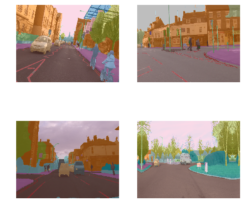
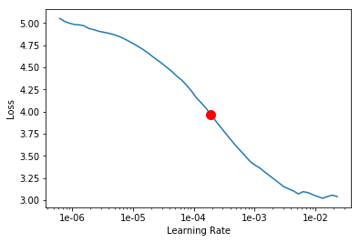
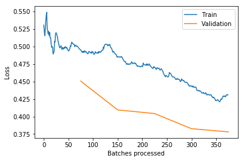

# Image Segmentation

Each pixel is classified as one of the possible classes. Segmentation is basically a classification problem for every single pixel.

> **Camvid**: Motion-based Segmentation and Recognition Dataset
* Segmentation dataset with per-pixel semantic segmentation of over 700 images, each inspected and confirmed by a second person for accuracy.
* Source : http://mi.eng.cam.ac.uk/research/projects/VideoRec/CamVid/


```
%reload_ext autoreload
%autoreload 2
%matplotlib inline
```


```
from fastai import *
from fastai.vision import *
from fastai.callbacks.hooks import *
from fastai.utils.mem import *
```


```
path = untar_data(URLs.CAMVID)
path.ls()
```


    [PosixPath('/root/.fastai/data/camvid/labels'),
     PosixPath('/root/.fastai/data/camvid/valid.txt'),
     PosixPath('/root/.fastai/data/camvid/codes.txt'),
     PosixPath('/root/.fastai/data/camvid/images')]


```
path_lbl = path/'labels'
path_img = path/'images'
```


```
path_img
```


    PosixPath('/root/.fastai/data/camvid/images')


```
fnames = get_image_files(path_img)
fnames[:3]
```


    [PosixPath('/root/.fastai/data/camvid/images/0016E5_07110.png'),
     PosixPath('/root/.fastai/data/camvid/images/0016E5_05790.png'),
     PosixPath('/root/.fastai/data/camvid/images/0006R0_f03630.png')]


```
lbl_names = get_image_files(path_lbl)
lbl_names[:3]
```


    [PosixPath('/root/.fastai/data/camvid/labels/0016E5_06000_P.png'),
     PosixPath('/root/.fastai/data/camvid/labels/0016E5_08220_P.png'),
     PosixPath('/root/.fastai/data/camvid/labels/0001TP_007560_P.png')]


```
img_f = fnames[5]
img = open_image(img_f) # opens the image
img.show(figsize=(5,5)) # displays the image
```


```
get_y_fn = lambda x : path_lbl/f'{x.stem}_P{x.suffix}'
```


```
get_y_fn(img_f)
```


    PosixPath('/root/.fastai/data/camvid/labels/0016E5_07983_P.png')


## Visualizing Segmentation Masks

> Difference between `open_image` and `open_mask` is that the mask values are not floats (they are integers) hence the image turns out to be B&W with `open_image`.


```
mask = open_image(get_y_fn(img_f))
mask.show(figsize=(5,5), alpha=1)
```


```
mask = open_mask(get_y_fn(img_f))
mask.show(figsize=(5,5), alpha=1)
```


> Notes :  
* RGB : 3 color channels 
* Each pixel takes = 3 bytes (one for each channel)
*  Additional info : P (for PIL images) means palettised i.e. 256 colors available, so instead of storing 3 bytes per pixel it only stores 1 byte which is the index in the palette. Advantages : Image require 1/3 original space. Disadvantage : It can only represent limited 256 colors.  L mode stores only 1 channel i.e. greyscale. L refers to Luminance. Compact, but does not store colors. Source : https://stackoverflow.com/questions/52307290/what-is-the-difference-between-images-in-p-and-l-mode-in-pil


```
src_size = np.array(mask.shape[1:])
src_size, mask.data
```


    (array([720, 960]), tensor([[[ 4,  4,  4,  ..., 26, 26, 26],
              [ 4,  4,  4,  ..., 26, 26, 26],
              [ 4,  4,  4,  ..., 26, 26, 26],
              ...,
              [19, 19, 19,  ..., 17, 17, 17],
              [19, 19, 19,  ..., 17, 17, 17],
              [19, 19, 19,  ..., 17, 17, 17]]]))


```
codes = np.loadtxt(path/'codes.txt', dtype=str)
codes
```


    array(['Animal', 'Archway', 'Bicyclist', 'Bridge', 'Building', 'Car', 'CartLuggagePram', 'Child', 'Column_Pole',
           'Fence', 'LaneMkgsDriv', 'LaneMkgsNonDriv', 'Misc_Text', 'MotorcycleScooter', 'OtherMoving', 'ParkingBlock',
           'Pedestrian', 'Road', 'RoadShoulder', 'Sidewalk', 'SignSymbol', 'Sky', 'SUVPickupTruck', 'TrafficCone',
           'TrafficLight', 'Train', 'Tree', 'Truck_Bus', 'Tunnel', 'VegetationMisc', 'Void', 'Wall'], dtype='<U17')


## Building model


```
size= src_size // 2; size
```


    array([360, 480])


```
free = gpu_mem_get_free_no_cache(); free
```


    11430


Batch size (depending on GPU memory)


```
bs = 8 if free > 8200 else 4; bs
```


    8


```
src = (SegmentationItemList.from_folder(path_img)
       .split_by_fname_file('../valid.txt')
       .label_from_func(get_y_fn, classes=codes))
```

`tfm_y` : Apply same transformations to y that was applied to x


```
data = (src.transform(get_transforms(), size=size, tfm_y=True)
        .databunch(bs=bs)
        .normalize(imagenet_stats))
```


```
data.show_batch(2, figsize=(7,7))
```





## Model

> Notes : 
* Downsampling images and then training  64x64 -> 128x128 -> 256x256 helps to train much faster and  generalize much better.
* Also called progressive resizing
* Going under 64x64 does not help as much
* We can pass vanilla accuracy as a metric for segmentation i.e. number of pixels correctly classified / total number of pixels
* Some of the pixel labels are **void** in camvid. Reporting accuracy should be done after removing void pixels.


```
name2id = {v : k for k,v in enumerate(codes)}; name2id
```


    {'Animal': 0,
     'Archway': 1,
     'Bicyclist': 2,
     'Bridge': 3,
     'Building': 4,
     'Car': 5,
     'CartLuggagePram': 6,
     'Child': 7,
     'Column_Pole': 8,
     'Fence': 9,
     'LaneMkgsDriv': 10,
     'LaneMkgsNonDriv': 11,
     'Misc_Text': 12,
     'MotorcycleScooter': 13,
     'OtherMoving': 14,
     'ParkingBlock': 15,
     'Pedestrian': 16,
     'Road': 17,
     'RoadShoulder': 18,
     'SUVPickupTruck': 22,
     'Sidewalk': 19,
     'SignSymbol': 20,
     'Sky': 21,
     'TrafficCone': 23,
     'TrafficLight': 24,
     'Train': 25,
     'Tree': 26,
     'Truck_Bus': 27,
     'Tunnel': 28,
     'VegetationMisc': 29,
     'Void': 30,
     'Wall': 31}


```
void_code = name2id['Void']
```


```
def acc_camvid(input, target):
    target = target.squeeze(1)
    mask = target != void_code # To handle void pixel labels
    return (input.argmax(dim=1)[mask]==target[mask]).float().mean()
```

> Notes : 
* We can use CNNs for segmentation, however U-Net architecture has superior performance
* Originally used in Biomedical Image Segmentation
* Works with few annotated training examples
* Paper : https://arxiv.org/abs/1505.04597
* Site : https://lmb.informatik.uni-freiburg.de/people/ronneber/u-net/


```
learn = unet_learner(data, models.resnet34, metrics=acc_camvid)
```

    Downloading: "https://download.pytorch.org/models/resnet34-333f7ec4.pth" to /root/.cache/torch/checkpoints/resnet34-333f7ec4.pth
    100%|██████████| 87306240/87306240 [00:06<00:00, 12538574.72it/s]


```
learn.lr_find()
```


    LR Finder is complete, type {learner_name}.recorder.plot() to see the graph.


> Notes : 
* Leslie Smith : "Train Learner over a few iterations. Start with a very low start_lr and change it at each mini-batch until it reaches a very high end_lr. Recorder will record the loss at each iteration. Plot those losses against the learning rate to find the optimal value before it diverges."
* We choose a value that is approximately in the middle of the sharpest downward slope - fastai library
* Learning rate annealing : Decreasing learning rate gradually.
* Increasing the learning rate gradually at the beginning allows wider exploration of the loss surface to find a global optima that generalizes better.


```
learn.recorder.plot(suggestion=True)
```

    Min numerical gradient: 1.91E-04
    Min loss divided by 10: 1.32E-03





```
lr = 2e-04
```


```
learn.fit_one_cycle(5, max_lr=slice(lr))
```


<table border="1" class="dataframe">
  <thead>
    <tr style="text-align: left;">
      <th>epoch</th>
      <th>train_loss</th>
      <th>valid_loss</th>
      <th>acc_camvid</th>
      <th>time</th>
    </tr>
  </thead>
  <tbody>
    <tr>
      <td>0</td>
      <td>1.875391</td>
      <td>0.972294</td>
      <td>0.780136</td>
      <td>04:04</td>
    </tr>
    <tr>
      <td>1</td>
      <td>1.009670</td>
      <td>0.640641</td>
      <td>0.839003</td>
      <td>03:53</td>
    </tr>
    <tr>
      <td>2</td>
      <td>0.727250</td>
      <td>0.586201</td>
      <td>0.849874</td>
      <td>03:54</td>
    </tr>
    <tr>
      <td>3</td>
      <td>0.589246</td>
      <td>0.471828</td>
      <td>0.867780</td>
      <td>03:53</td>
    </tr>
    <tr>
      <td>4</td>
      <td>0.526200</td>
      <td>0.452067</td>
      <td>0.870356</td>
      <td>03:53</td>
    </tr>
  </tbody>
</table>


```
learn.save('stage-1-resnet34')
```


```
# learn.load('stage-1-resent34')
```


```
learn.unfreeze()
```


```
learn.lr_find()
```


    LR Finder is complete, type {learner_name}.recorder.plot() to see the graph.


```
learn.recorder.plot()
```


```
lrs = slice(1e-06, lr/5) # 1e-05 would have worked as well
```


```
learn.fit_one_cycle(5, max_lr=lrs)
```


<table border="1" class="dataframe">
  <thead>
    <tr style="text-align: left;">
      <th>epoch</th>
      <th>train_loss</th>
      <th>valid_loss</th>
      <th>acc_camvid</th>
      <th>time</th>
    </tr>
  </thead>
  <tbody>
    <tr>
      <td>0</td>
      <td>0.495537</td>
      <td>0.450617</td>
      <td>0.870499</td>
      <td>04:02</td>
    </tr>
    <tr>
      <td>1</td>
      <td>0.484754</td>
      <td>0.409501</td>
      <td>0.882051</td>
      <td>04:01</td>
    </tr>
    <tr>
      <td>2</td>
      <td>0.470532</td>
      <td>0.404248</td>
      <td>0.878563</td>
      <td>04:02</td>
    </tr>
    <tr>
      <td>3</td>
      <td>0.443996</td>
      <td>0.382654</td>
      <td>0.885266</td>
      <td>04:03</td>
    </tr>
    <tr>
      <td>4</td>
      <td>0.430890</td>
      <td>0.378070</td>
      <td>0.885534</td>
      <td>04:02</td>
    </tr>
  </tbody>
</table>


```
learn.recorder.plot_losses()
```





```
learn.recorder.plot_lr()
```


```
learn.save('stage-2-resnet34')
```

## Training on full-size images (all pixels)


```
src_size
```


    array([720, 960])


```
size = src_size
```


```
free = gpu_mem_get_free_no_cache(); free
```


    11430


Set batch size (depending on GPU memory)


```
bs = 4 # reduce batch size since all the pixels from the original are considered
```


```
src = (SegmentationItemList.from_folder(path_img)
       .split_by_fname_file('../valid.txt')
       .label_from_func(get_y_fn, classes=codes))
```


```
data = (src.transform(get_transforms(), size=size, tfm_y=True)
        .databunch(bs=bs)
        .normalize(imagenet_stats))
```


```
data.show_batch(2, figsize=(7,7))
```


## Mixed precision training

Instead of using single precision floating points, use half precision floating points i.e. 32 bits to 16 bits. This increases speed of operations and consumes less GPU RAM (useful when running out of GPU memory).

* A double-precision number uses twice as many bits as a regular floating-point number (source : https://stackoverflow.com/questions/801117/whats-the-difference-between-a-single-precision-and-double-precision-floating-p)
* Add `.to_fp16()` at the end of learner to use half precision floating points.


```
learn = unet_learner(data, models.resnet34, metrics=acc_camvid).to_fp16()
```

### Load the pretrained model (trained on half of the pixels)


```
learn.load('stage-2-resnet34');
```


```
# learn.summary()
```

### Find optimal learning rate


```
learn.lr_find()
```


```
learn.recorder.plot
```

### Train


```
learn.fit_one_cycle(5, max_lr=lr)
```

## Key ideas & takeaways

* Incase the GPU runs out of memory, start with half the pixels in the original image or a smaller batch size.
* Mixed Precision Training : Using half precision floating point numbers for operations can also help (and lead to faster training).
* U-Net architecture performs better over conventional CNNs for image segmentation.
* Increasing the LR gradually actually leads to greater exploration of the loss landscape and increases the probability of finding the optimal weights. Also leads to faster training/convergence and better generalization overall. 

## References

[1] fast.ai v3 Part 1 Lesson 3 https://course.fast.ai/videos/?lesson=3
