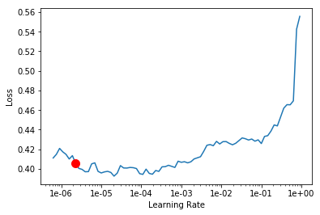

# Language Model and Sentiment Analysis

Some common NLP applications with text classification : 
- Spam detection
- Identifying fake news
- Diagnosis of medical records

## Few pointers :

- `fastai.text` module is used for NLP
- For NLP we create two models : Language models and Tuner
- SOTA on IMDB is ~95%
- Always use original stats of the pretrained model datasets. 

E.g. classifying different types of green frogs, if we  used our own per channel mean and std (0,1) would convert things to gray. So when using a pretrained model on ImageNet (1000 classes), we must use the ImageNet stats for standardization.

## Activation functions

- Identity
- Binary step
- Logistic AKA Sigmoid AKA Soft step
- Softmax
- Tanh  
etc ..

## Optimizers

- SGD
- ADAM
- RMSprop

Universal function approximators : It can approximate anything. We just need to find the parameter/weight matrices via gradient descent.

Old/traditional NLP methods mostly used n-grams e.g. A bigram would be 'San Francisco'.

## Sentiment Analysis : Movie Review

> Idea : Language Model (WikiText 103) -> Language Model (IMDb) -> Classifier (IMDb)

- 1 bit of information representing sentiments.

- We start out with randomly initialized weight matrices. However, if we use transfer learning we have good weight matrices. A pretrained model in NLP would be a Language Model.  

- A language model predicts the next word in a sentence/phase. n-grams were used previously (not very good in terms of performance).

- If we train a neural network to predict the next word, it can complete sentences. It would learn english in a way. 

> Idea : Learning about the world through text (language).

- Using a general pretrained language model on say **WikiText 103**, we can then train another language model which is specifically good at predicting next words in movie reviews with IMDb as the target corpus (corpus is a collection of documents).

- Self-supervised learning since we don't need labels for the second language model. It just needs to capture the context in the target corpus and be great at predicting the next word in similar setting.

- Karpathy in his Phd, created a language model of text in LateX documents and then automatically generate papers in LateX.


```
# magic commands
%reload_ext autoreload
%autoreload 2
%matplotlib inline
```


```
from fastai import *
from fastai.text import *
```

The **IMDb dataset**
- 100,000 reviews
- 25,000 labelled as positive and negative for training 
- 25,000 labelled for testing
- 50,000 unlabelled

Using a sample of the dataset,


```
path = untar_data(URLs.IMDB_SAMPLE)
path.ls()
```


    [PosixPath('/root/.fastai/data/imdb_sample/texts.csv')]


```
df = pd.read_csv(path/'texts.csv')
df.head()
```


<div>
<style scoped>
    .dataframe tbody tr th:only-of-type {
        vertical-align: middle;
    }

    .dataframe tbody tr th {
        vertical-align: top;
    }

    .dataframe thead th {
        text-align: right;
    }
</style>
<table border="1" class="dataframe">
  <thead>
    <tr style="text-align: right;">
      <th></th>
      <th>label</th>
      <th>text</th>
      <th>is_valid</th>
    </tr>
  </thead>
  <tbody>
    <tr>
      <th>0</th>
      <td>negative</td>
      <td>Un-bleeping-believable! Meg Ryan doesn't even ...</td>
      <td>False</td>
    </tr>
    <tr>
      <th>1</th>
      <td>positive</td>
      <td>This is a extremely well-made film. The acting...</td>
      <td>False</td>
    </tr>
    <tr>
      <th>2</th>
      <td>negative</td>
      <td>Every once in a long while a movie will come a...</td>
      <td>False</td>
    </tr>
    <tr>
      <th>3</th>
      <td>positive</td>
      <td>Name just says it all. I watched this movie wi...</td>
      <td>False</td>
    </tr>
    <tr>
      <th>4</th>
      <td>negative</td>
      <td>This movie succeeds at being one of the most u...</td>
      <td>False</td>
    </tr>
  </tbody>
</table>
</div>


```
df.shape
```


    (1000, 3)


```
df['text'][3]
```


    'Name just says it all. I watched this movie with my dad when it came out and having served in Korea he had great admiration for the man. The disappointing thing about this film is that it only concentrate on a short period of the man\'s life - interestingly enough the man\'s entire life would have made such an epic bio-pic that it is staggering to imagine the cost for production.<br /><br />Some posters elude to the flawed characteristics about the man, which are cheap shots. The theme of the movie "Duty, Honor, Country" are not just mere words blathered from the lips of a high-brassed officer - it is the deep declaration of one man\'s total devotion to his country.<br /><br />Ironically Peck being the liberal that he was garnered a better understanding of the man. He does a great job showing the fearless general tempered with the humane side of the man.'


If we ignore the flag, we can create a databunch as follows,


```
data_lm = TextDataBunch.from_csv(path, 'texts.csv')
```


```
data_lm
```


    TextClasDataBunch;
    
    Train: LabelList (799 items)
    x: TextList
    xxbos xxmaj he now has a name , an identity , some memories and a a lost girlfriend . xxmaj all he wanted was to disappear , but still , they traced him and destroyed the world he hardly built . xxmaj now he wants some explanation , and to get ride of the people how made him what he is . xxmaj yeah , xxmaj jason xxmaj bourne is back , and this time , he 's here with a vengeance . 
     
      xxup ok , this movie does n't have the most xxunk script in the world , but its thematics are very clever and ask some serious questions about our society . xxmaj of course , like every xxmaj xxunk movie since the end of the 90 's , " xxmaj the xxmaj bourne xxmaj suprematy " is a super - heroes story . xxmaj jason xxmaj bourne is a xxmaj captain - xxmaj america project - like , who 's gone completely wrong . xxmaj in the first movie , the hero discovered his abilities and he accepted them in the second one . xxmaj he now fights against what he considers like evil , after a person close to him has been killed ( his girlfriend in " xxmaj suprematy " ) by them . xxmaj that 's all a part of the super - hero story , including a character with ( realistic but still impressive : he almost invincible ) super powers . 
     
      xxmaj and the interesting point is that the evil he fights all across the world ( there 's no xxunk in the xxmaj bourne 's movies , characters are going from one continent to another in the blink of an eye ) , is , as in the best seasons of " 24 " , an xxmaj american enemy , who 's beliefs that he fight for the good of his country completely blinds him . xxmaj funny how " mad patriots " are now the xxup xxunk enemies of xxunk xxmaj hollywood 's stories . 
     
      xxmaj beside all those interesting thematics , the movie is n't flawless : the feminine character of xxmaj xxunk xxmaj xxunk is for now on completely useless and the direction is quite unoriginal when it comes to dialogs scenes . xxmaj but all that does n't really matter , for " xxmaj the xxmaj bourne xxmaj ultimatum " is an action movie . xxmaj and the action scenes are rather impressive . 
     
      xxmaj everyone here is talking about the " xxmaj xxunk scene " and the " xxmaj tanger pursuit " and everyone 's right . i particularly enjoyed the fight in xxmaj tanger , that reminds my in its exaggeration and xxunk the works of xxmaj xxunk xxmaj xxunk . xxmaj visually inventive scenes , lots of intelligent action parts and a good reflection on xxmaj american 's contemporary thematics : " xxmaj the xxmaj bourne xxmaj ultimatum " is definitely the best movie of the series and a very interesting and original action flick .,xxbos xxmaj the combination of reading the xxmaj xxunk and viewing this film has inspired my wife and i to new levels . xxmaj recently i was pondering a statement made by the artist xxmaj thomas xxmaj kinkade in one of his inspirational books ; xxmaj he states : " xxmaj you and i were not designed to xxunk the xxunk air of five xxunk traffic . xxmaj nor do i think xxmaj god had xxunk television programs , media hype , worthless xxunk , and soul pollution in mind when he created the universe ... " i had n't seen " a river runs through it " in a couple of years , but after pondering xxmaj kinkade 's statement something drew me to watch the film with a spiritual eye . i watched it and saw a whole new world to the film and it inspired me to read the book ( a must read ) . i have always been frustrated in xxmaj southern xxmaj california but somehow got caught up in its xxunk society . xxmaj the film really puts into perspective of how we should really experience xxmaj god 's creations . a combination of xxmaj xxunk story and my desire to move back to the xxmaj northwest has driven me to move to xxmaj montana . i want my future kids to be able to rome the landscape , go fly - fishing with me , ride horses into nothing but open land and xxunk lakes set in the xxunk . a place where you seldom worry about crime . i look around xxunk and all i see is shopping xxunk , rude snarling people in their xxmaj xxunk xxmaj xxunk , miles of xxunk on congested xxunk , gangs , racial turmoil on the verge of violent xxunk , and everyone skeptical of each others intentions . 
     
      xxmaj anyway the movie is very inspiring with brilliant acting and a deep story about the xxunk connections of loved ones . xxmaj there is a lot of deep thinking in this film . xxmaj the scenery is worth seeing alone and actually helps xxunk tension . xxmaj you should finish this film relaxed yet full of xxunk to your own life . xxmaj it takes a xxunk , intelligent , and spiritual person to really grasp the meaning . xxmaj if you do n't understand the art of cinema and how a director achieves his goals through dialogue , tone , light , colour , scenery , camera angles / movement , etc . xxmaj then this film is probably not for the crowd that thinks " xxmaj the xxmaj fast and the xxmaj furious " is the greatest film . xxmaj granted it was entertaining but shallow . 
     
      xxmaj the bottom line : xxmaj this film helps to realize that life is not about how much money you have or what things you posses . xxmaj rather it is about your relationships with family and friends and the experiences you share together . xxup quality xxup not xxup xxunk,xxbos xxmaj most italian horror lovers seem to hate this movie since because it has no connection to the first two xxmaj demons films . xxmaj and with the " xxmaj demons xxup iii " in the title , one would assume it would . xxmaj the problem is that this film was never intended to be part of the xxmaj demons series . xxmaj the distributors only a " xxmaj demons xxup iii " above its original title " xxmaj the xxmaj ogre " to cash in on the other films popularity . xxmaj the new xxmaj american xxup dvd release of this picture has the title " xxmaj demons xxup iii : xxmaj the xxmaj ogre " on the box art but the film itself only says " xxmaj the xxmaj ogre " . i do n't know if past releases had the title " xxmaj demons xxup iii " on the actual film itself , but this new release just seems to be a little white lie . xxmaj if you can get past the " xxmaj demons xxup iii " in the title , you might some enjoyment in " xxmaj the xxmaj ogre " . xxmaj it starts out with a creep intro , and stays pretty creep throughout . xxmaj there 's no gore and the film movies slowly , but i still xxunk it . xxmaj just do n't expect it to be like the other xxmaj demons films . i give " xxmaj the xxmaj ogre " 7 out of 10 . xxmaj italian fans should try it out .,xxbos xxmaj this movie had some xxunk xxunk , but it 's an old story that simply could never happen . xxmaj navy xxunk could never break down that much that a crew much less an xxup xxunk could ever go that far against the xxmaj captain . i 'll take xxmaj dr. xxmaj xxunk any day if i wish to see this plot . xxmaj sidenote -- the xxup us xxmaj navy did not support this film .,xxbos xxmaj director / writer xxmaj michael xxmaj winner 's feature is a better than expected offbeat supernatural horror film ( although still schlock efficiently catered for ) , which really does by go xxunk . xxmaj sure it might borrow ideas from other similar xxunk horror movies of this period , but still manages to bring its own psychological xxunk to the xxunk material ( of good vs. evil ) and a unique vision that has a fair share of impressively xxunk , if somewhat exploitative set - pieces . xxmaj as a whole it 's xxunk , however remains intriguing by instilling an ominous charge without going gang - xxunk with the scares . xxmaj actually there 's always something going on amongst its busy framework , but it 's rather down - played with its shocks xxunk to soapy patterns and atmospheric xxunk , up until its xxunk repellent and grisly climax with a downbeat revelation . xxmaj winner 's dressed up xxunk might feel pedestrian , however it 's the ensemble cast that really holds it together 
      as you try to spot the faces . xxmaj there 's plenty too . xxmaj some having more to do with the scheme of things than others , but there 's no doubts every one of them are committed , despite the xxunk crude nature of it all . xxmaj it 's interesting to see names like xxmaj sylvia xxmaj miles ( who 's significantly creepy ! ) , xxmaj beverly d'angelo ( likewise ) , xxmaj deborah xxmaj xxunk , xxmaj eli xxmaj wallach , xxmaj christopher xxmaj walken , xxmaj william xxmaj hickey ( a neat cameo ) , xxmaj jeff xxmaj goldblum , xxmaj jerry xxmaj orbach and xxmaj tom xxmaj berenger in bit parts . xxmaj then you got a mild - mannered xxmaj chris xxmaj xxunk and xxunk gorgeous xxmaj cristina xxmaj raines in the leads . xxmaj offering able support xxmaj xxunk xxmaj ferrer , xxmaj martin xxmaj balsam , xxmaj ava xxmaj gardner , xxmaj john xxmaj carradine , xxmaj burgess xxmaj xxunk and xxmaj arthur xxmaj kennedy . xxmaj the script does throw around many characters , as well as notions but gets xxunk xxunk by trying to squeeze all of it in . xxmaj however it 's xxunk air works in its favour in establishing the xxunk and deception of what 's really going on here . xxmaj is there a reason for all of this , and why is it surrounding xxmaj raines ' character ? xxmaj the emphasis is mainly built upon that moody angle , as it begins to slowly shed light of her inner goings and that of the strange / worrying experiences she encounters when she 's moves into her new apartment . xxmaj this is where xxmaj winner tries to pull out the eerie shades , which projects some xxunk moments . xxmaj xxunk xxmaj xxunk was the man responsible for the grand , xxunk orchestral score that never misses a xxunk and xxmaj richard xxup xxunk xxmaj xxunk xxunk the sweeping , scope - like photography .
    y: CategoryList
    positive,positive,positive,negative,positive
    Path: /root/.fastai/data/imdb_sample;
    
    Valid: LabelList (201 items)
    x: TextList
    xxbos xxmaj may contain spoilers . 
     
      i say that , but anyone xxunk enough to be reading this can probably figure out every plot turn right from the start . 
     
      xxmaj this is not a movie that i liked . i did n't hate it in the way of some movies that insult your intelligence , but it all felt too predictable on its xxunk to the xxunk happy ending . xxmaj there were funny bits along the way to be sure , but few were original . xxmaj at least it did n't go for the gutter . 
     
      xxmaj christina xxmaj xxunk looks fresh , and xxmaj ben xxmaj xxunk works hard . xxmaj their scenes together are actually the only redeeming feature . xxmaj everyone else is a cardboard xxunk , including , surprisingly , xxmaj james xxmaj xxunk , who must have made this as a favor to someone . 
     
      xxmaj all in all , it 's a harmless , but not inspiring , 90 minutes .,xxbos i do have the ` guts ' to inform you to please stay away from ` xxmaj dahmer ' , the xxunk film based on the real - life story of the grotesque serial killer . ` xxmaj dahmer ' xxunk more in relation to the xxunk of its focused subject . xxmaj jeffrey xxmaj dahmer , who murdered over 15 young xxunk and xxunk some of their body parts , was probably the most xxunk serial killer of our generation . xxmaj however , the real sick individuals are the filmmakers of this awful xxunk who should have had their heads examined before deciding to xxunk this awful ` xxunk ' project . xxmaj this is not an easy film to xxunk , even though xxmaj jeffrey would have easily xxunk it with some fiery ` xxunk ' xxunk or even some real - life ` xxmaj mr. xxmaj xxunk xxunk ' . * xxmaj failure,xxbos a sequel to ( actually a remake of ) xxmaj disney 's 1996 live - action remake of xxunk xxmaj xxunk . xxmaj xxunk devil ( xxmaj glenn xxmaj close ) is released from prison after being " xxunk " of her obsession with fur by a xxunk named xxmaj dr. xxmaj xxunk ( ugh ! ) . xxmaj but the " cure " is broken when xxmaj xxunk hears the xxunk of xxmaj big xxmaj ben , and she once again goes on a mad quest to make herself the perfect coat out of xxunk hides . 
     
      xxmaj this movie is bad on so many levels , starting with the fact that it 's a " xxmaj xxunk family schlock " movie designed to suck every last available dime out of the xxmaj disney xxunk machine . xxmaj glenn xxmaj close xxwrep 2 xxunk acts as xxmaj xxunk . xxmaj with all that she had to put up with in this movie -- the lame script , the endless makeup , getting xxunk in a cake at the end -- i hope they gave her an extremely - large xxunk . 
     
      ( xxmaj speaking of which , where in the world are you going to find a fur coat factory , a xxunk with a xxmaj xxunk xxmaj xxunk assembly line , and a xxunk xxunk all xxunk within the same building -- as you do in the climax of this film ? ) xxmaj of course , the real stars of the movie are supposed to be the dogs . xxmaj they serve as the " xxmaj macaulay xxmaj culkin 's " of this movie , pulling all the stupid " xxmaj home xxmaj alone " gags on the villains . ( xxmaj biting them in the crotch , running over their hands with xxunk xxunk , xxunk them with xxunk , etc . , etc . , etc . , ad xxunk . ) i have to admit , the dogs were fairly good actors -- much better than the humans . 
     
      xxmaj gerard xxmaj xxunk is completely wasted in this movie as a xxunk - out xxmaj french xxunk . xxmaj the two human " dog lovers " -- xxunk from the earlier film , but with different actors -- are completely boring . xxmaj when they have a spaghetti dinner at an xxmaj italian xxunk , the movie cuts back and forth between the two lovers , and their dogs at home , watching the dinner scene from " xxmaj lady and the xxmaj xxunk . " i thought to myself , " xxmaj oh please , do n't go there ! " i half - expected the humans to do a satire on the " xxmaj lady and the xxmaj xxunk " dinner scene -- as xxmaj charlie xxmaj xxunk did in " xxmaj hot xxmaj shots : xxmaj part xxmaj xxunk " -- doing the " spaghetti xxunk kiss , " pushing the xxunk with his nose , etc . 
     
      xxmaj and do n't get me started on the annoying xxunk with xxmaj eric xxmaj xxunk 's voice . 
     
      xxmaj the costumes were nominated for an xxmaj oscar , and the costumes in the movie * are * good . xxmaj but they are the only good thing in the movie . xxmaj the rest of it is unbearable dreck .,xxbos xxmaj this movie has no plot and no focus . xxmaj yes , it 's supposed to be a slap - stick , stupid comedy , but the screen - writers have no idea what the movie was about . xxmaj even the title does n't go along with the movie . xxmaj it should have been called " xxmaj cool xxmaj ethan " or " xxmaj xxunk xxmaj never xxmaj win " or something like that . xxmaj the characters are not developed and no one cares what happens to them ! xxmaj the girl xxunk character ( from xxmaj that 70 's xxmaj show ) was the only person worth watching . xxmaj she was hilarious and stole every scene she was in . xxmaj the others need to make sure that their own college xxunk are in the works since they 'll need a career other than acting .,xxbos xxmaj this movie is not that interesting , except for the first ten minutes . xxmaj the pace and editing are a perfect introduction in an ensemble piece , even better than say xxmaj xxunk xxmaj park . xxmaj then it xxunk slows down , loses focus and starts resembling a traditional xxmaj french movie only to regain focus in the end with the love relation between xxmaj xxunk ( xxmaj xxunk ) and xxmaj xxunk ( xxmaj xxunk ) . xxmaj in the middle there are too many xxunk and loose ends in the story , several threads started are not ended . 
     
      xxrep 7 * xxup spoilers xxup ahead xxmaj the main story is the relation between xxmaj xxunk and xxmaj xxunk . xxmaj he has been xxunk to her after his relation with her many years ago , despite her xxunk and setting up home in xxmaj xxunk . xxmaj as xxunk he now xxunk his own life and xxunk hers by taking the mask of xxmaj xxunk 's marriage . xxmaj having accomplished this , he is xxunk after a freak accident ( literally ) and becomes a xxunk . xxmaj he wakes only after she has burned their old picture as indication that they 've xxunk with the past and can properly start their lives again together . xxrep 7 * xxup end xxup of xxup spoilers 
     
      xxmaj it remains xxunk what vision this director wants us to see us because there are so many other stories here : xxmaj xxunk xxunk want to enter xxmaj europe , there are frequent radio xxunk about the xxunk of xxmaj iraq 's former xxunk . xxmaj xxunk 's child is xxunk and is bitten by dogs ( loyalty ) once he meets his boyfriend , whereas the girl he lives with seems to be sick ( of that ? ) . xxmaj her sister is traditional xxmaj xxunk , and enters a relation with xxmaj xxunk 's husband . xxmaj it portrays xxmaj xxunk as unnecessary xxunk , despite all the building there is a strange xxunk vision shining through that almost xxunk the past . xxmaj it portrays xxmaj islam as xxunk and prone to xxunk , which may sometimes be true , but certainly not in general . xxmaj in the end it can all best be described as adding some xxunk xxunk and xxunk xxunk xxunk . 
     
      xxmaj xxunk and xxmaj xxunk are great . xxmaj with this material they are so familiar they are able to spin something extra in every scene : xxunk an xxunk , body language , xxunk pride , awkward behavior . xxmaj the movie itself is disappointing and only xxunk the limited role of xxmaj french cinema in the world nowadays . xxmaj with some notable exceptions of course .
    y: CategoryList
    negative,negative,negative,negative,negative
    Path: /root/.fastai/data/imdb_sample;
    
    Test: None


`TextDataBunch` does both tokenization and numericalization behind the scenes.


```
data_lm.save()
```

To load a text databunch,


```
data = load_data(path)
```

### Tokenization


```
path.ls()
```


    [PosixPath('/root/.fastai/data/imdb_sample/texts.csv'),
     PosixPath('/root/.fastai/data/imdb_sample/data_save.pkl')]


```
data = load_data(path)
```


```
data.show_batch()
```


<table border="1" class="dataframe">
  <thead>
    <tr style="text-align: right;">
      <th>text</th>
      <th>target</th>
    </tr>
  </thead>
  <tbody>
    <tr>
      <td>xxbos xxmaj raising xxmaj victor xxmaj vargas : a xxmaj review \n \n  xxmaj you know , xxmaj raising xxmaj victor xxmaj vargas is like sticking your hands into a big , steaming bowl of xxunk . xxmaj it 's warm and gooey , but you 're not sure if it feels right . xxmaj try as i might , no matter how warm and gooey xxmaj raising xxmaj</td>
      <td>negative</td>
    </tr>
    <tr>
      <td>xxbos xxup the xxup shop xxup around xxup the xxup corner is one of the sweetest and most feel - good romantic comedies ever made . xxmaj there 's just no getting around that , and it 's hard to actually put one 's feeling for this film into words . xxmaj it 's not one of those films that tries too hard , nor does it come up with</td>
      <td>positive</td>
    </tr>
    <tr>
      <td>xxbos xxmaj this film sat on my xxmaj tivo for weeks before i watched it . i dreaded a self - indulgent xxunk flick about relationships gone bad . i was wrong ; this was an xxunk xxunk into the screwed - up xxunk of xxmaj new xxmaj yorkers . \n \n  xxmaj the format is the same as xxmaj max xxmaj xxunk ' " xxmaj la xxmaj ronde</td>
      <td>positive</td>
    </tr>
    <tr>
      <td>xxbos xxmaj many neglect that this is n't just a classic due to the fact that it 's the first xxup 3d game , or even the first xxunk - up . xxmaj it 's also one of the first stealth games , one of the xxunk definitely the first ) truly claustrophobic games , and just a pretty well - xxunk gaming experience in general . xxmaj with graphics</td>
      <td>positive</td>
    </tr>
    <tr>
      <td>xxbos i really wanted to love this show . i truly , honestly did . \n \n  xxmaj for the first time , gay viewers get their own version of the " xxmaj the xxmaj bachelor " . xxmaj with the help of his obligatory " hag " xxmaj xxunk , xxmaj james , a good looking , well - to - do thirty - something has the chance</td>
      <td>negative</td>
    </tr>
  </tbody>
</table>


### Numericalization

- Conversion of tokens to integers
- Keep tokens that appear atleast twice
- Max default vocab size is 60,000
- Replace the others by UNK - Not common enough!
- `itos` stands for int to string
- We use the ids to replace the tokens
- Every token in vocab would have a row in the weight matrix of the NN, so restrict to 60000 (default)
- Special tokens like `xx` field if we have title, abstract, body etc


```
data.vocab.itos[:10]
```


    ['xxunk',
     'xxpad',
     'xxbos',
     'xxeos',
     'xxfld',
     'xxmaj',
     'xxup',
     'xxrep',
     'xxwrep',
     'the']


```
data.train_ds[0][0]
```


    Text xxbos xxmaj as a baseball die - hard , this movie goes contrary to what i expect in a sports movie : authentic - looking sports action , believable characters , and an original story line . xxmaj while " xxmaj angels in the xxmaj xxunk " fails miserably in the first category , it succeeds beautifully in the latter two . " xxmaj angels " weaves the story of xxmaj roger and xxup j.p. , two xxmaj xxunk foster kids in love with baseball but searching for a family , with that of the xxunk xxmaj angels franchise , struggling to draw fans and win games . xxmaj pushed by his xxunk father 's promise that they would be a family only when the xxmaj angels win the xxunk , xxmaj roger asks for some heavenly help , and gets it in the form of diamond - dwelling xxunk bent on xxunk the franchise 's downward spiral . xxmaj and , when short - xxunk manager xxmaj george xxmaj knox ( portrayed by xxmaj danny xxmaj glover ) begins believing in what xxmaj roger sees , the team suddenly has hope for turning their season around -- and xxmaj roger and xxup j.p. find something to believe in . xxmaj glover in particular gives a nice performance , and xxmaj tony xxmaj xxunk , playing a washed - up pitcher , also does well , despite clearly having xxup zero idea of how to pitch out of the xxunk !


Numericalized version :


```
data.train_ds[0][0].data[:10]
```


    array([   2,    5,   27,   13, 1164,  760,   24,  260,   11,   21])


### With data block API

Use datablock API for a more flexible approach  rather than using the factory methods (with fastai defaults) as above. We have to manually call : tokenization and numericalization steps. 


```
data = (TextList.from_csv(path, 'texts.csv', cols='text')
       .split_from_df(col=2)
       .label_from_df(cols=0)
       .databunch())
```

Grabbing the full dataset,


```
path = untar_data(URLs.IMDB)
```


```
path.ls()
```


    [PosixPath('/root/.fastai/data/imdb/test'),
     PosixPath('/root/.fastai/data/imdb/tmp_lm'),
     PosixPath('/root/.fastai/data/imdb/README'),
     PosixPath('/root/.fastai/data/imdb/unsup'),
     PosixPath('/root/.fastai/data/imdb/imdb.vocab'),
     PosixPath('/root/.fastai/data/imdb/tmp_clas'),
     PosixPath('/root/.fastai/data/imdb/train')]


```
(path/'train').ls()
```


    [PosixPath('/root/.fastai/data/imdb/train/neg'),
     PosixPath('/root/.fastai/data/imdb/train/pos'),
     PosixPath('/root/.fastai/data/imdb/train/labeledBow.feat'),
     PosixPath('/root/.fastai/data/imdb/train/unsupBow.feat')]


## Language Model

Also start with good weights with transfer learning such as a **Wikitext 103** language model. No reason to start with random weights. Then we can fine tune this language model on the IMDb dataset to create another language model for our purposes because the english used form IMDb reviews isn't the same as the english used for Wikipedia.

> Note : We can use the text in test set to train the language model. Use all of the text from the dataset to train the language model. Here we can make use unlabelled data to train the language model!

`usup` here means unsupervised i.e. without labels. For a language model, the labels are its own text! 

The rules are all listed below, here is the meaning of the special tokens:

    UNK (xxunk) is for an unknown word (one that isn't present in the current vocabulary)
    PAD (xxpad) is the token used for padding, if we need to regroup several texts of different lengths in a batch
    BOS (xxbos) represents the beginning of a text in your dataset
    FLD (xxfld) is used if you set mark_fields=True in your TokenizeProcessor to separate the different fields of texts (if your texts are loaded from several columns in a dataframe)
    TK_MAJ (xxmaj) is used to indicate the next word begins with a capital in the original text
    TK_UP (xxup) is used to indicate the next word is written in all caps in the original text
    TK_REP (xxrep) is used to indicate the next character is repeated n times in the original text (usage xxrep n {char})
    TK_WREP(xxwrep) is used to indicate the next word is repeated n times in the original text (usage xxwrep n {word})
    
Let's create a databunch of the full IMDb dataset and prepare it for training a language model with weights initialized from the WikiText 103 pretrained language model.


```
data_lm = (TextList.from_folder(path)
          .filter_by_folder(include=['train', 'test', 'unsup'])
          .split_by_rand_pct(0.1)
          .label_for_lm()
          .databunch(bs=42)) # batch size

data_lm.save('data_lm.pkl')
```

Load the databunch for the language model,


```
data_lm = load_data(path, 'data_lm.pkl', bs=42)
```


```
data_lm.show_batch()
```


<table border="1" class="dataframe">
  <thead>
    <tr style="text-align: right;">
      <th>idx</th>
      <th>text</th>
    </tr>
  </thead>
  <tbody>
    <tr>
      <td>0</td>
      <td>, get tattoos , hang about doing nothing , etc . etc , xxmaj they generally imagine themselves to be hard and every so often shout challenging rap chants into the camera . xxmaj filmed in xxup mtv style , fast cuts , crazy camera angles , tight close ups and animation interludes . xxmaj the dialogue might have been crisper in the original languages of xxmaj mandarin and xxmaj</td>
    </tr>
    <tr>
      <td>1</td>
      <td>remind the viewer of the classic van dam films . parts of the plot do n't make sense and seem to be added in to use up time . the end plot is that of a very basic type that does n't leave the viewer guessing and any twists are obvious from the beginning . the end scene with the flask backs do n't make sense as they are added</td>
    </tr>
    <tr>
      <td>2</td>
      <td>'re asked to say , and should n't be believed . xxmaj the fact that the injured policeman supports xxmaj jackson is moderately plausible , but still a bit convenient ( and what if he had died ? ) i find it hard to believe that the xxup kkk would march down the street in broad daylight . xxmaj other apparently serious crimes ( riot , arson , kidnapping ,</td>
    </tr>
    <tr>
      <td>3</td>
      <td>" xxunk " . xxmaj and it would have helped if the dialogue had n't been swamped by noisy locations or scenes flooded with distracting and inappropriate music . xxmaj the plot is ludicrous : xxmaj the lost xxmaj charles xxmaj dickens story supposedly helps our hero solve a series of modern murders , but so would a copy of xxmaj herge 's xxmaj adventures xxmaj of xxmaj tintin ,</td>
    </tr>
    <tr>
      <td>4</td>
      <td>, really , that 's how it starts ) . xxmaj just then he gets a visit by his agent and best friend . xxmaj he mentions to her that he has learned from the paper that a certain millionaire has died , which takes the story 14 years back . xxmaj he can still see and is about to direct his next film . xxmaj he stars the inexperienced</td>
    </tr>
  </tbody>
</table>


> Note : For RNNs, decreasing the momentum helps.

Now we create a RNN learner (here we are using **AWD_LSTM** instead of **Wikitext 103** for transfer learning)


```
learn = language_model_learner(data_lm, AWD_LSTM, drop_mult=0.3)
```


```
learn.lr_find()
```


    LR Finder is complete, type {learner_name}.recorder.plot() to see the graph.


```
learn.recorder.plot(skip_end=15)
```


Fine tuning the last layers,


```
learn.fit_one_cycle(1, 1e-02, moms=(0.8,0.7))
```


<table border="1" class="dataframe">
  <thead>
    <tr style="text-align: left;">
      <th>epoch</th>
      <th>train_loss</th>
      <th>valid_loss</th>
      <th>accuracy</th>
      <th>time</th>
    </tr>
  </thead>
  <tbody>
    <tr>
      <td>0</td>
      <td>4.166260</td>
      <td>4.043005</td>
      <td>0.295039</td>
      <td>49:30</td>
    </tr>
  </tbody>
</table>


> Note : Accuracy of ~0.3 is good enough initially. For limited domain documents like medical and legal transcripts, we can have even higher accuracy.


```
learn.save('fit_head')
```


```
learn.load('fit_head');
```

Let's fine tune the model now. First we unfreeze the layers i.e. make them trainable and then train them for a few more epochs.


```
learn.unfreeze()
```


```
learn.fit_one_cycle(10, 1e-03, moms(0.8, 0.7)) # note : this takes a few hours
```


```
learn.save('fine_tuned')
```

Lets see how well our language model predicts the next word given a few words,


```
text = 'I liked this movie because'
n_words = 40
n_sentences = 2
```


```
print("\n".join(learn.predict(text, n_words, temperature=0.75) 
                for _ in range(n_sentences)))
```

    I liked this movie because i was very surprised to see the movie . The Spanish director , Ang Lee , is a fan of Hollywood and do n't know if the movie has been done . There 's
    I liked this movie because of the acting . i seriously enjoyed the movie . This really good movie is a great movie to watch . Bad acting and the good acting , terrible acting and cinematography . The acting is terrible


It does not make a whole lot of sense, but atleast it not completely random. We only care about the **encoder** inside the model and not neccesarily the part that predicts the next word. 

> Think of the language model as having two parts : 
1. The encoder understands the sentences i.e. the part responsible for creating and updating the hidden states in a RNN  
2. The decoder predicts the next word  


Lets save the encoder part as follows,


```
learn.save_encoder('fine_tuned_enc')
```

## Classifier

The vocab for the classifier needs to be the same as the vocab used for training the language model.


```
path = untar_data(URLs.IMDB)
```


```
data_clas = (TextList.from_folder(path, vocab=data_lm.vocab)
             #grab all the text files in path
             .split_by_folder(valid='test')
             #split by train and valid folder (that only keeps 'train' and 'test' so no need to filter)
             .label_from_folder(classes=['neg', 'pos'])
             #label them all with their folders
             .databunch(bs=42))

data_clas.save('data_clas.pkl')
```


```
data_clas = load_data(path, 'data_clas.pkl', bs=42)
```


```
data_clas.show_batch()
```


<table border="1" class="dataframe">
  <thead>
    <tr style="text-align: right;">
      <th>text</th>
      <th>target</th>
    </tr>
  </thead>
  <tbody>
    <tr>
      <td>xxbos xxmaj match 1 : xxmaj tag xxmaj team xxmaj table xxmaj match xxmaj bubba xxmaj ray and xxmaj spike xxmaj dudley vs xxmaj eddie xxmaj guerrero and xxmaj chris xxmaj benoit xxmaj bubba xxmaj ray and xxmaj spike xxmaj dudley started things off with a xxmaj tag xxmaj team xxmaj table xxmaj match against xxmaj eddie xxmaj guerrero and xxmaj chris xxmaj benoit . xxmaj according to the rules</td>
      <td>pos</td>
    </tr>
    <tr>
      <td>xxbos * * * xxup spoilers * * * * * * xxup spoilers * * * xxmaj continued ... \n \n  xxmaj from here on in the whole movie collapses in on itself . xxmaj first we meet a rogue program with the indication we 're gon na get ghosts and vampires and werewolves and the like . xxmaj we get a guy with a retarded accent talking</td>
      <td>neg</td>
    </tr>
    <tr>
      <td>xxbos xxup myra xxup breckinridge is one of those rare films that established its place in film history immediately . xxmaj praise for the film was absolutely nonexistent , even from the people involved in making it . xxmaj this film was loathed from day one . xxmaj while every now and then one will come across some maverick who will praise the film on philosophical grounds ( aggressive feminism</td>
      <td>neg</td>
    </tr>
    <tr>
      <td>xxbos i felt duty bound to watch the 1983 xxmaj timothy xxmaj dalton / xxmaj zelah xxmaj clarke adaptation of " xxmaj jane xxmaj eyre , " because i 'd just written an article about the 2006 xxup bbc " xxmaj jane xxmaj eyre " for xxunk . \n \n  xxmaj so , i approached watching this the way i 'd approach doing homework . \n \n  i</td>
      <td>pos</td>
    </tr>
    <tr>
      <td>xxbos xxmaj it has said that xxmaj the xxmaj movies and xxmaj baseball both thrived during xxmaj the xxmaj great xxmaj depression . xxmaj it appears that the grim realities of a xxmaj nation caught up in the aftermath of this xxmaj economic xxmaj disaster created a need for occasional relief for the populace . a temporary escape could be found in the on going soap opera that is xxmaj</td>
      <td>pos</td>
    </tr>
  </tbody>
</table>


Now create a model to classify those reviews and load the encoder we save previously,


```
learn = text_classifier_learner(data_clas, AWD_LSTM, drop_mult=0.5)
learn.load_encoder('fine_tuned_enc')
learn.freeze()
```

Change the dropout accordingly (to counter overfitting or underfitting)


```
learn.lr_find()
```


    LR Finder is complete, type {learner_name}.recorder.plot() to see the graph.


```
learn.recorder.plot(suggestion=True)
```

    Min numerical gradient: 3.63E-03
    Min loss divided by 10: 2.09E-02


```
learn.fit_one_cycle(1, 2e-02, moms=(0.8,0.7))
```


<table border="1" class="dataframe">
  <thead>
    <tr style="text-align: left;">
      <th>epoch</th>
      <th>train_loss</th>
      <th>valid_loss</th>
      <th>accuracy</th>
      <th>time</th>
    </tr>
  </thead>
  <tbody>
    <tr>
      <td>0</td>
      <td>0.417254</td>
      <td>0.348688</td>
      <td>0.851400</td>
      <td>05:47</td>
    </tr>
  </tbody>
</table>


```
learn.save('stage-1')
```


```
learn.load('stage-1');
```

Now rather than unfreezing, 


```
learn.freeze_to(-2) # unfreeze the last two layers
```


```
learn.lr_find()
learn.recorder.plot(suggestion=True)
```

    Min numerical gradient: 2.29E-06
    Min loss divided by 10: 2.09E-06





> Note : As we are using discriminative learning rates, we are using a factor of **1/(2.6^4)** for lower layers. For NLP RNN **2.6** was found by using a random forest with different hyperparameters. We can use RF to find optimal hyperparameters.


```
 # why were these learnin rates chosen?
learn.fit_one_cycle(1, slice(1e-2/(2.6**4), 1e-2), moms=(0.8,0.7))
```


<table border="1" class="dataframe">
  <thead>
    <tr style="text-align: left;">
      <th>epoch</th>
      <th>train_loss</th>
      <th>valid_loss</th>
      <th>accuracy</th>
      <th>time</th>
    </tr>
  </thead>
  <tbody>
    <tr>
      <td>0</td>
      <td>0.324650</td>
      <td>0.220821</td>
      <td>0.913880</td>
      <td>07:08</td>
    </tr>
  </tbody>
</table>


We are already getting 91% here! We can continue with this approach and keep on training,


```
learn.save('stage-2')
```


```
learn.load('stage-2');
```


```
learn.freeze_to(-3) # unfreeze the last 3 layers
learn.fit_one_cycle(1, slice(5e-3/(2.6**4), 5e-3), moms=(0.8,0.7))
```


<table border="1" class="dataframe">
  <thead>
    <tr style="text-align: left;">
      <th>epoch</th>
      <th>train_loss</th>
      <th>valid_loss</th>
      <th>accuracy</th>
      <th>time</th>
    </tr>
  </thead>
  <tbody>
    <tr>
      <td>0</td>
      <td>0.249512</td>
      <td>0.182321</td>
      <td>0.930680</td>
      <td>10:09</td>
    </tr>
  </tbody>
</table>


```
learn.save('stage-3')
```


```
learn.load('stage-3');
```

Now unfreezing all the layers and training one last time,


```
learn.unfreeze() # unfreeze all the layers
learn.fit_one_cycle(1, slice(1e-2/(2.6**4), 1e-2), moms=(0.8,0.7))
```


<table border="1" class="dataframe">
  <thead>
    <tr style="text-align: left;">
      <th>epoch</th>
      <th>train_loss</th>
      <th>valid_loss</th>
      <th>accuracy</th>
      <th>time</th>
    </tr>
  </thead>
  <tbody>
    <tr>
      <td>0</td>
      <td>0.238269</td>
      <td>0.171374</td>
      <td>0.937400</td>
      <td>12:18</td>
    </tr>
  </tbody>
</table>


```
learn.save('final')
```

This gives us a 93% accuracy. 

> Note : Here only the encodings from the initial language model (with minimal fine-tuning) was used. Accuracy can be improved with a better encodings from a language model trained on more number of epochs.

## Sentiment prediction

Now lets see how the model predicts the sentiments of the following (made-up) reviews,


```
learn.predict("I really loved that movie, and it was awesome!")
```


    (Category pos, tensor(1), tensor([1.0743e-04, 9.9989e-01]))


```
learn.predict("The movie wasn't that great.")
```


    (Category neg, tensor(0), tensor([0.7747, 0.2253]))


```
learn.predict("Absolutely terrible movie. Although I really liked the acting and the cinematography.")
```


    (Category neg, tensor(0), tensor([0.9891, 0.0109]))


