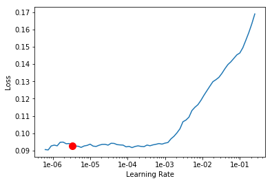
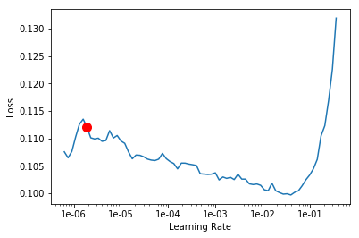

## Multi label image classification

Multi label classification refers to when each training instance has more than one class or label.

## Importing Libraries


```
%reload_ext autoreload
%autoreload 2 # Reload all modules (except those excluded by %aimport) every time before executing the Python code typed.
%matplotlib inline

# Run this cell to mount your Google Drive.
from google.colab import drive
drive.mount('/content/drive')
```


```
from fastai.vision import *
```

## Downloading dataset from Kaggle


```
path = Path('drive/My Drive/fast.ai')
```


```
!ls -al
```

    total 20
    drwxr-xr-x 1 root root 4096 Jul  9 03:59 .
    drwxr-xr-x 1 root root 4096 Jul  9 03:58 ..
    drwxr-xr-x 1 root root 4096 Jul  3 16:14 .config
    drwx------ 3 root root 4096 Jul  9 03:59 drive
    drwxr-xr-x 1 root root 4096 Jul  3 16:14 sample_data


Copy the uploaded `kaggle.json` which contains a unique API key to `~/.kaggle`


```
! mkdir -p ~/.kaggle/
! cp drive/'My Drive'/fast.ai/kaggle.json ~/.kaggle/
```


```
! ls -al ~/
```

    total 76
    drwx------ 1 root root 4096 Jul  9 09:51 .
    drwxr-xr-x 1 root root 4096 Jul  9 03:58 ..
    -rw------- 1 root root  751 Jul  9 03:59 .bash_history
    -rw-r--r-- 1 root root 3106 Apr  9  2018 .bashrc
    drwx------ 1 root root 4096 Jul  9 06:05 .cache
    drwx------ 1 root root 4096 Jul  9 03:59 .config
    drwxr-xr-x 3 root root 4096 Jul  3 16:15 .gsutil
    drwxr-xr-x 1 root root 4096 Jul  3 16:51 .ipython
    drwx------ 2 root root 4096 Jul  3 16:51 .jupyter
    drwxr-xr-x 2 root root 4096 Jul  9 09:52 .kaggle
    drwxr-xr-x 2 root root 4096 Jul  9 03:58 .keras
    drwx------ 1 root root 4096 Jul  3 16:51 .local
    drwxr-xr-x 3 root root 4096 Jul  3 16:51 .node-gyp
    drwxr-xr-x 4 root root 4096 Jul  3 16:51 .npm
    drwx------ 3 root root 4096 Jul  9 05:56 .nv
    -rw-r--r-- 1 root root  148 Aug 17  2015 .profile


```
!ls drive/'My Drive'/fast.ai/.kaggle
```

    kaggle.json


Install kaggle for downloading the datasets required as follows,


```
!pip install kaggle --upgrade
```

    Requirement already up-to-date: kaggle in /usr/local/lib/python3.6/dist-packages (1.5.4)
    Requirement already satisfied, skipping upgrade: certifi in /usr/local/lib/python3.6/dist-packages (from kaggle) (2019.6.16)
    Requirement already satisfied, skipping upgrade: six>=1.10 in /usr/local/lib/python3.6/dist-packages (from kaggle) (1.12.0)
    Requirement already satisfied, skipping upgrade: requests in /usr/local/lib/python3.6/dist-packages (from kaggle) (2.21.0)
    Requirement already satisfied, skipping upgrade: urllib3<1.25,>=1.21.1 in /usr/local/lib/python3.6/dist-packages (from kaggle) (1.24.3)
    Requirement already satisfied, skipping upgrade: tqdm in /usr/local/lib/python3.6/dist-packages (from kaggle) (4.28.1)
    Requirement already satisfied, skipping upgrade: python-slugify in /usr/local/lib/python3.6/dist-packages (from kaggle) (3.0.2)
    Requirement already satisfied, skipping upgrade: python-dateutil in /usr/local/lib/python3.6/dist-packages (from kaggle) (2.5.3)
    Requirement already satisfied, skipping upgrade: idna<2.9,>=2.5 in /usr/local/lib/python3.6/dist-packages (from requests->kaggle) (2.8)
    Requirement already satisfied, skipping upgrade: chardet<3.1.0,>=3.0.2 in /usr/local/lib/python3.6/dist-packages (from requests->kaggle) (3.0.4)
    Requirement already satisfied, skipping upgrade: text-unidecode==1.2 in /usr/local/lib/python3.6/dist-packages (from python-slugify->kaggle) (1.2)


```
path = path/'planet'
path
```


    PosixPath('drive/My Drive/fast.ai/planet')


> Note :
* Accept competition rules in Kaggle before downloading the datasets.
* Put quotes around the paths e.g. `"{path}"` to be safe, since the path variable expands before execution and might have spaces.

Downloading the training dataset


```
! kaggle competitions download -c planet-understanding-the-amazon-from-space -f train-jpg.tar.7z -p "{path}"
! kaggle competitions download -c planet-understanding-the-amazon-from-space -f train_v2.csv -p "{path}"  
! unzip -q -n "{path}/train_v2.csv.zip" -d "{path}"
```

    Downloading train-jpg.tar.7z to drive/My Drive/fast.ai/planet
    100% 600M/600M [00:07<00:00, 105MB/s]
    100% 600M/600M [00:08<00:00, 78.5MB/s]
    Downloading train_v2.csv.zip to drive/My Drive/fast.ai/planet
      0% 0.00/159k [00:00<?, ?B/s]
    100% 159k/159k [00:00<00:00, 19.1MB/s]


Downloading the test dataset


```
! kaggle competitions download -c planet-understanding-the-amazon-from-space -f test-jpg.tar.7z -p "{path}"
```

    Downloading test-jpg.tar.7z to drive/My Drive/fast.ai
     99% 598M/603M [00:10<00:00, 60.2MB/s]
    100% 603M/603M [00:10<00:00, 60.4MB/s]


Unzip `7z` and `tar` files as follows,


```
! sudo apt install p7zip
```

    Reading package lists... Done
    Building dependency tree       
    Reading state information... Done
    p7zip is already the newest version (16.02+dfsg-6).
    p7zip set to manually installed.
    The following package was automatically installed and is no longer required:
      libnvidia-common-410
    Use 'sudo apt autoremove' to remove it.
    0 upgraded, 0 newly installed, 0 to remove and 16 not upgraded.


```
!7z x -so "{path}/planet/train-jpg.tar.7z" | tar xf - -C "{path.as_posix()}"
```

Here in the planet dataset, each training instance has multiple labels 


```
df = pd.read_csv(path/'planet/train_v2.csv')
df.head()
```


<div>
<style scoped>
    .dataframe tbody tr th:only-of-type {
        vertical-align: middle;
    }

    .dataframe tbody tr th {
        vertical-align: top;
    }

    .dataframe thead th {
        text-align: right;
    }
</style>
<table border="1" class="dataframe">
  <thead>
    <tr style="text-align: right;">
      <th></th>
      <th>image_name</th>
      <th>tags</th>
    </tr>
  </thead>
  <tbody>
    <tr>
      <th>0</th>
      <td>train_0</td>
      <td>haze primary</td>
    </tr>
    <tr>
      <th>1</th>
      <td>train_1</td>
      <td>agriculture clear primary water</td>
    </tr>
    <tr>
      <th>2</th>
      <td>train_2</td>
      <td>clear primary</td>
    </tr>
    <tr>
      <th>3</th>
      <td>train_3</td>
      <td>clear primary</td>
    </tr>
    <tr>
      <th>4</th>
      <td>train_4</td>
      <td>agriculture clear habitation primary road</td>
    </tr>
  </tbody>
</table>
</div>


## Creating a DataBunch


Notes :  
`Dataset` class from PyTorch is an abstract class.It contains,
* __getitem__ : objects can be indexed o[..]
* __len__ : len()

`torch.utils.data.DataLoader`

* Takes `Dataset` in its *constructor*

### Data Augmentation & Transformations


> Notes :
* Satellite images can be flipped vertically (not just horizontally)
* No perspective warping 


```
tfms = get_transforms(flip_vert=True, max_lighting=0.1, 
                      max_zoom=1.05, max_warp=0.)
```

### Creating a DataBunch


```
np.random.seed(42)
src = (ImageList.from_csv(path/'planet', 'train_v2.csv', folder='train-jpg', suffix='.jpg')
       .split_by_rand_pct(0.2)
       .label_from_df(label_delim=' '))
```


```
print(src)
```

    LabelLists;
    
    Train: LabelList (32384 items)
    x: ImageList
    Image (3, 256, 256),Image (3, 256, 256),Image (3, 256, 256),Image (3, 256, 256),Image (3, 256, 256)
    y: MultiCategoryList
    haze;primary,clear;primary,clear;primary,haze;primary;water,agriculture;clear;cultivation;primary;water
    Path: drive/My Drive/fast.ai/planet;
    
    Valid: LabelList (8095 items)
    x: ImageList
    Image (3, 256, 256),Image (3, 256, 256),Image (3, 256, 256),Image (3, 256, 256),Image (3, 256, 256)
    y: MultiCategoryList
    clear;primary;road,clear;primary;water,clear;conventional_mine;habitation;primary;road;water,cloudy,agriculture;clear;cultivation;cultivation;habitation;primary;road;water
    Path: drive/My Drive/fast.ai/planet;
    
    Test: None


```
data = (src.transform(tfms, size=128)
        .databunch().normalize(imagenet_stats))
```


```
data
```


    ImageDataBunch;
    
    Train: LabelList (32384 items)
    x: ImageList
    Image (3, 128, 128),Image (3, 128, 128),Image (3, 128, 128),Image (3, 128, 128),Image (3, 128, 128)
    y: MultiCategoryList
    haze;primary,clear;primary,clear;primary,haze;primary;water,agriculture;clear;cultivation;primary;water
    Path: drive/My Drive/fast.ai/planet;
    
    Valid: LabelList (8095 items)
    x: ImageList
    Image (3, 128, 128),Image (3, 128, 128),Image (3, 128, 128),Image (3, 128, 128),Image (3, 128, 128)
    y: MultiCategoryList
    clear;primary;road,clear;primary;water,clear;conventional_mine;habitation;primary;road;water,cloudy,agriculture;clear;cultivation;cultivation;habitation;primary;road;water
    Path: drive/My Drive/fast.ai/planet;
    
    Test: None


```
data.show_batch(rows=3, figsize=(12,9))
```


## Model building

Defining the architecture and key metrics


```
arch = models.resnet50
acc_02 = partial(accuracy_thresh, thresh=0.2)
f_score = partial(fbeta, thresh=0.2) # the kaggle leaderboard used F2 for evaluation 
```

Creating a learner (model) as follows,


```
learn = create_cnn(data, arch, metrics=[acc_02, f_score])
```


```
print(len(data.classes))
data.classes
```

    17


    ['agriculture',
     'artisinal_mine',
     'bare_ground',
     'blooming',
     'blow_down',
     'clear',
     'cloudy',
     'conventional_mine',
     'cultivation',
     'habitation',
     'haze',
     'partly_cloudy',
     'primary',
     'road',
     'selective_logging',
     'slash_burn',
     'water']


> Before training a learner (model) always use the `lr_finder()` to give a good estimate of an optimal learning rate. A constant learning rate could be used for all the layers or alternatively discriminative layer training could be used. For the first stage of training, a constant learning rate should be used (i.e. same lr for all the hidden layers).


```
learn.lr_find()
```


    LR Finder is complete, type {learner_name}.recorder.plot() to see the graph.


```
learn.recorder.plot(suggestion=True) # To get the steepest gradient in the curve
```

    Min numerical gradient: 2.29E-02
    Min loss divided by 10: 3.02E-02


```
lr = 1e-02 # Selecting a lr which is ~10x less than the lowest point
```


```
learn.fit_one_cycle(5, slice(lr,2*lr)) # Use a single value preferably, at this stage
```


<table border="1" class="dataframe">
  <thead>
    <tr style="text-align: left;">
      <th>epoch</th>
      <th>train_loss</th>
      <th>valid_loss</th>
      <th>accuracy_thresh</th>
      <th>fbeta</th>
      <th>time</th>
    </tr>
  </thead>
  <tbody>
    <tr>
      <td>0</td>
      <td>0.121974</td>
      <td>0.109485</td>
      <td>0.947593</td>
      <td>0.904228</td>
      <td>05:21</td>
    </tr>
    <tr>
      <td>1</td>
      <td>0.118723</td>
      <td>0.112468</td>
      <td>0.948719</td>
      <td>0.901510</td>
      <td>05:08</td>
    </tr>
    <tr>
      <td>2</td>
      <td>0.109833</td>
      <td>0.099239</td>
      <td>0.952425</td>
      <td>0.914233</td>
      <td>05:06</td>
    </tr>
    <tr>
      <td>3</td>
      <td>0.098617</td>
      <td>0.091248</td>
      <td>0.960164</td>
      <td>0.922337</td>
      <td>05:01</td>
    </tr>
    <tr>
      <td>4</td>
      <td>0.092172</td>
      <td>0.104946</td>
      <td>0.955281</td>
      <td>0.925882</td>
      <td>05:05</td>
    </tr>
  </tbody>
</table>


```
learn.save('stage-1-resnet50')
```


```
# For loading the model
# learn.load('stage-1-resnet50')
```


```
learn.summary()
```


    Sequential
    ======================================================================
    Layer (type)         Output Shape         Param #    Trainable 
    ======================================================================
    Conv2d               [64, 64, 64]         9,408      False     
    ______________________________________________________________________
    BatchNorm2d          [64, 64, 64]         128        True      
    ______________________________________________________________________
    ReLU                 [64, 64, 64]         0          False     
    ______________________________________________________________________
    MaxPool2d            [64, 32, 32]         0          False     
    ______________________________________________________________________
    Conv2d               [64, 32, 32]         4,096      False     
    ______________________________________________________________________
    BatchNorm2d          [64, 32, 32]         128        True      
    ______________________________________________________________________
    Conv2d               [64, 32, 32]         36,864     False     
    ______________________________________________________________________
    BatchNorm2d          [64, 32, 32]         128        True      
    ______________________________________________________________________
    Conv2d               [256, 32, 32]        16,384     False     
    ______________________________________________________________________
    BatchNorm2d          [256, 32, 32]        512        True      
    ______________________________________________________________________
    ReLU                 [256, 32, 32]        0          False     
    ______________________________________________________________________
    Conv2d               [256, 32, 32]        16,384     False     
    ______________________________________________________________________
    BatchNorm2d          [256, 32, 32]        512        True      
    ______________________________________________________________________
    Conv2d               [64, 32, 32]         16,384     False     
    ______________________________________________________________________
    BatchNorm2d          [64, 32, 32]         128        True      
    ______________________________________________________________________
    Conv2d               [64, 32, 32]         36,864     False     
    ______________________________________________________________________
    BatchNorm2d          [64, 32, 32]         128        True      
    ______________________________________________________________________
    Conv2d               [256, 32, 32]        16,384     False     
    ______________________________________________________________________
    BatchNorm2d          [256, 32, 32]        512        True      
    ______________________________________________________________________
    ReLU                 [256, 32, 32]        0          False     
    ______________________________________________________________________
    Conv2d               [64, 32, 32]         16,384     False     
    ______________________________________________________________________
    BatchNorm2d          [64, 32, 32]         128        True      
    ______________________________________________________________________
    Conv2d               [64, 32, 32]         36,864     False     
    ______________________________________________________________________
    BatchNorm2d          [64, 32, 32]         128        True      
    ______________________________________________________________________
    Conv2d               [256, 32, 32]        16,384     False     
    ______________________________________________________________________
    BatchNorm2d          [256, 32, 32]        512        True      
    ______________________________________________________________________
    ReLU                 [256, 32, 32]        0          False     
    ______________________________________________________________________
    Conv2d               [128, 32, 32]        32,768     False     
    ______________________________________________________________________
    BatchNorm2d          [128, 32, 32]        256        True      
    ______________________________________________________________________
    Conv2d               [128, 16, 16]        147,456    False     
    ______________________________________________________________________
    BatchNorm2d          [128, 16, 16]        256        True      
    ______________________________________________________________________
    Conv2d               [512, 16, 16]        65,536     False     
    ______________________________________________________________________
    BatchNorm2d          [512, 16, 16]        1,024      True      
    ______________________________________________________________________
    ReLU                 [512, 16, 16]        0          False     
    ______________________________________________________________________
    Conv2d               [512, 16, 16]        131,072    False     
    ______________________________________________________________________
    BatchNorm2d          [512, 16, 16]        1,024      True      
    ______________________________________________________________________
    Conv2d               [128, 16, 16]        65,536     False     
    ______________________________________________________________________
    BatchNorm2d          [128, 16, 16]        256        True      
    ______________________________________________________________________
    Conv2d               [128, 16, 16]        147,456    False     
    ______________________________________________________________________
    BatchNorm2d          [128, 16, 16]        256        True      
    ______________________________________________________________________
    Conv2d               [512, 16, 16]        65,536     False     
    ______________________________________________________________________
    BatchNorm2d          [512, 16, 16]        1,024      True      
    ______________________________________________________________________
    ReLU                 [512, 16, 16]        0          False     
    ______________________________________________________________________
    Conv2d               [128, 16, 16]        65,536     False     
    ______________________________________________________________________
    BatchNorm2d          [128, 16, 16]        256        True      
    ______________________________________________________________________
    Conv2d               [128, 16, 16]        147,456    False     
    ______________________________________________________________________
    BatchNorm2d          [128, 16, 16]        256        True      
    ______________________________________________________________________
    Conv2d               [512, 16, 16]        65,536     False     
    ______________________________________________________________________
    BatchNorm2d          [512, 16, 16]        1,024      True      
    ______________________________________________________________________
    ReLU                 [512, 16, 16]        0          False     
    ______________________________________________________________________
    Conv2d               [128, 16, 16]        65,536     False     
    ______________________________________________________________________
    BatchNorm2d          [128, 16, 16]        256        True      
    ______________________________________________________________________
    Conv2d               [128, 16, 16]        147,456    False     
    ______________________________________________________________________
    BatchNorm2d          [128, 16, 16]        256        True      
    ______________________________________________________________________
    Conv2d               [512, 16, 16]        65,536     False     
    ______________________________________________________________________
    BatchNorm2d          [512, 16, 16]        1,024      True      
    ______________________________________________________________________
    ReLU                 [512, 16, 16]        0          False     
    ______________________________________________________________________
    Conv2d               [256, 16, 16]        131,072    False     
    ______________________________________________________________________
    BatchNorm2d          [256, 16, 16]        512        True      
    ______________________________________________________________________
    Conv2d               [256, 8, 8]          589,824    False     
    ______________________________________________________________________
    BatchNorm2d          [256, 8, 8]          512        True      
    ______________________________________________________________________
    Conv2d               [1024, 8, 8]         262,144    False     
    ______________________________________________________________________
    BatchNorm2d          [1024, 8, 8]         2,048      True      
    ______________________________________________________________________
    ReLU                 [1024, 8, 8]         0          False     
    ______________________________________________________________________
    Conv2d               [1024, 8, 8]         524,288    False     
    ______________________________________________________________________
    BatchNorm2d          [1024, 8, 8]         2,048      True      
    ______________________________________________________________________
    Conv2d               [256, 8, 8]          262,144    False     
    ______________________________________________________________________
    BatchNorm2d          [256, 8, 8]          512        True      
    ______________________________________________________________________
    Conv2d               [256, 8, 8]          589,824    False     
    ______________________________________________________________________
    BatchNorm2d          [256, 8, 8]          512        True      
    ______________________________________________________________________
    Conv2d               [1024, 8, 8]         262,144    False     
    ______________________________________________________________________
    BatchNorm2d          [1024, 8, 8]         2,048      True      
    ______________________________________________________________________
    ReLU                 [1024, 8, 8]         0          False     
    ______________________________________________________________________
    Conv2d               [256, 8, 8]          262,144    False     
    ______________________________________________________________________
    BatchNorm2d          [256, 8, 8]          512        True      
    ______________________________________________________________________
    Conv2d               [256, 8, 8]          589,824    False     
    ______________________________________________________________________
    BatchNorm2d          [256, 8, 8]          512        True      
    ______________________________________________________________________
    Conv2d               [1024, 8, 8]         262,144    False     
    ______________________________________________________________________
    BatchNorm2d          [1024, 8, 8]         2,048      True      
    ______________________________________________________________________
    ReLU                 [1024, 8, 8]         0          False     
    ______________________________________________________________________
    Conv2d               [256, 8, 8]          262,144    False     
    ______________________________________________________________________
    BatchNorm2d          [256, 8, 8]          512        True      
    ______________________________________________________________________
    Conv2d               [256, 8, 8]          589,824    False     
    ______________________________________________________________________
    BatchNorm2d          [256, 8, 8]          512        True      
    ______________________________________________________________________
    Conv2d               [1024, 8, 8]         262,144    False     
    ______________________________________________________________________
    BatchNorm2d          [1024, 8, 8]         2,048      True      
    ______________________________________________________________________
    ReLU                 [1024, 8, 8]         0          False     
    ______________________________________________________________________
    Conv2d               [256, 8, 8]          262,144    False     
    ______________________________________________________________________
    BatchNorm2d          [256, 8, 8]          512        True      
    ______________________________________________________________________
    Conv2d               [256, 8, 8]          589,824    False     
    ______________________________________________________________________
    BatchNorm2d          [256, 8, 8]          512        True      
    ______________________________________________________________________
    Conv2d               [1024, 8, 8]         262,144    False     
    ______________________________________________________________________
    BatchNorm2d          [1024, 8, 8]         2,048      True      
    ______________________________________________________________________
    ReLU                 [1024, 8, 8]         0          False     
    ______________________________________________________________________
    Conv2d               [256, 8, 8]          262,144    False     
    ______________________________________________________________________
    BatchNorm2d          [256, 8, 8]          512        True      
    ______________________________________________________________________
    Conv2d               [256, 8, 8]          589,824    False     
    ______________________________________________________________________
    BatchNorm2d          [256, 8, 8]          512        True      
    ______________________________________________________________________
    Conv2d               [1024, 8, 8]         262,144    False     
    ______________________________________________________________________
    BatchNorm2d          [1024, 8, 8]         2,048      True      
    ______________________________________________________________________
    ReLU                 [1024, 8, 8]         0          False     
    ______________________________________________________________________
    Conv2d               [512, 8, 8]          524,288    False     
    ______________________________________________________________________
    BatchNorm2d          [512, 8, 8]          1,024      True      
    ______________________________________________________________________
    Conv2d               [512, 4, 4]          2,359,296  False     
    ______________________________________________________________________
    BatchNorm2d          [512, 4, 4]          1,024      True      
    ______________________________________________________________________
    Conv2d               [2048, 4, 4]         1,048,576  False     
    ______________________________________________________________________
    BatchNorm2d          [2048, 4, 4]         4,096      True      
    ______________________________________________________________________
    ReLU                 [2048, 4, 4]         0          False     
    ______________________________________________________________________
    Conv2d               [2048, 4, 4]         2,097,152  False     
    ______________________________________________________________________
    BatchNorm2d          [2048, 4, 4]         4,096      True      
    ______________________________________________________________________
    Conv2d               [512, 4, 4]          1,048,576  False     
    ______________________________________________________________________
    BatchNorm2d          [512, 4, 4]          1,024      True      
    ______________________________________________________________________
    Conv2d               [512, 4, 4]          2,359,296  False     
    ______________________________________________________________________
    BatchNorm2d          [512, 4, 4]          1,024      True      
    ______________________________________________________________________
    Conv2d               [2048, 4, 4]         1,048,576  False     
    ______________________________________________________________________
    BatchNorm2d          [2048, 4, 4]         4,096      True      
    ______________________________________________________________________
    ReLU                 [2048, 4, 4]         0          False     
    ______________________________________________________________________
    Conv2d               [512, 4, 4]          1,048,576  False     
    ______________________________________________________________________
    BatchNorm2d          [512, 4, 4]          1,024      True      
    ______________________________________________________________________
    Conv2d               [512, 4, 4]          2,359,296  False     
    ______________________________________________________________________
    BatchNorm2d          [512, 4, 4]          1,024      True      
    ______________________________________________________________________
    Conv2d               [2048, 4, 4]         1,048,576  False     
    ______________________________________________________________________
    BatchNorm2d          [2048, 4, 4]         4,096      True      
    ______________________________________________________________________
    ReLU                 [2048, 4, 4]         0          False     
    ______________________________________________________________________
    AdaptiveAvgPool2d    [2048, 1, 1]         0          False     
    ______________________________________________________________________
    AdaptiveMaxPool2d    [2048, 1, 1]         0          False     
    ______________________________________________________________________
    Flatten              [4096]               0          False     
    ______________________________________________________________________
    BatchNorm1d          [4096]               8,192      True      
    ______________________________________________________________________
    Dropout              [4096]               0          False     
    ______________________________________________________________________
    Linear               [512]                2,097,664  True      
    ______________________________________________________________________
    ReLU                 [512]                0          False     
    ______________________________________________________________________
    BatchNorm1d          [512]                1,024      True      
    ______________________________________________________________________
    Dropout              [512]                0          False     
    ______________________________________________________________________
    Linear               [17]                 8,721      True      
    ______________________________________________________________________
    
    Total params: 25,623,633
    Total trainable params: 2,168,721
    Total non-trainable params: 23,454,912
    Optimized with 'torch.optim.adam.Adam', betas=(0.9, 0.99)
    Using true weight decay as discussed in https://www.fast.ai/2018/07/02/adam-weight-decay/ 
    Loss function : FlattenedLoss
    ======================================================================
    Callbacks functions applied 


### Fine tuning

Now we unfreeze all the layers and make them trainable (i.e. internally sets the layers' `requires_grad` attribute to `True`)


```
learn.unfreeze()
```

> One approach would be to create a DataBunch with only the misclassified examples and train a bit more (with Discriminative layer training).


```
learn.lr_find()
```


    LR Finder is complete, type {learner_name}.recorder.plot() to see the graph.


```
learn.recorder.plot(suggestion=True)
```

    Min numerical gradient: 3.31E-06
    Min loss divided by 10: 7.59E-08





> Rule of thumb : 
1. For 1st part of the slice() choose a point 10x less than the point where the plot starts going up
2. For 2nd part : use lr/5 or lr/10
Here lr is the learning rate used for the frozen part.
* The suggested point should only be selected after taking the whole plot into account.


```
x = 5 # or 10
```


```
learn.fit_one_cycle(5, slice(1e-04, lr/x))
```


<table border="1" class="dataframe">
  <thead>
    <tr style="text-align: left;">
      <th>epoch</th>
      <th>train_loss</th>
      <th>valid_loss</th>
      <th>accuracy_thresh</th>
      <th>fbeta</th>
      <th>time</th>
    </tr>
  </thead>
  <tbody>
    <tr>
      <td>0</td>
      <td>0.101230</td>
      <td>0.116825</td>
      <td>0.947433</td>
      <td>0.915841</td>
      <td>05:08</td>
    </tr>
    <tr>
      <td>1</td>
      <td>0.097826</td>
      <td>0.106008</td>
      <td>0.947651</td>
      <td>0.915129</td>
      <td>05:04</td>
    </tr>
    <tr>
      <td>2</td>
      <td>0.093937</td>
      <td>0.130889</td>
      <td>0.955920</td>
      <td>0.924243</td>
      <td>05:02</td>
    </tr>
    <tr>
      <td>3</td>
      <td>0.089579</td>
      <td>0.118575</td>
      <td>0.957163</td>
      <td>0.927488</td>
      <td>05:00</td>
    </tr>
    <tr>
      <td>4</td>
      <td>0.088840</td>
      <td>0.107080</td>
      <td>0.958122</td>
      <td>0.927841</td>
      <td>04:58</td>
    </tr>
  </tbody>
</table>


```
learn.save('stage-2-resnet50')
```

## Transfer learning from smaller image sizes to larger image sizes

Downsampled images can be used for quick experimentation.

>Question - How can we use a model trained on 128x128 pixel images for training 256x265 pixel images?


We can fine tune the pretrained model. 256x256 images would contain more information than its 128 counterparts.

### New DataBunch with 256x256 images


```
data = (src.transform(tfms, size=256)
        .databunch().normalize(imagenet_stats))

learn.data = data
```


```
data.train_ds[0]
```


    (Image (3, 256, 256), MultiCategory haze;primary)


```
learn.freeze()
```


```
learn.lr_find()
```


```
learn.recorder.plot(suggestion=True)
```

    Min numerical gradient: 1.91E-06
    Min loss divided by 10: 3.98E-03





```
lr = 1e-02
```


```
learn.fit_one_cycle(5, max_lr=slice(lr))
```


```
learn.save('stage-1-256-resnet50')
```

Similarly we can continue to train and fine tune the model,


```
learn.unfreeze()
```


```
learn.lr_find()
```


```
learn.recorder.plot(suggestion=True)
```


```
learn.fit_one_cycle(5, max_lr=slice(1e-05, lr/5))
```


```
learn.save('stage-1-256-resnet50')
```

## References

[1] https://course.fast.ai/videos/?lesson=3  
[2] https://pytorch.org/tutorials/beginner/data_loading_tutorial.html
