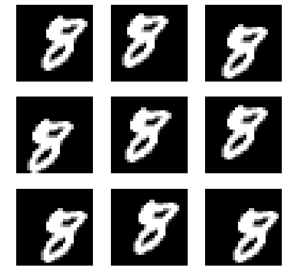
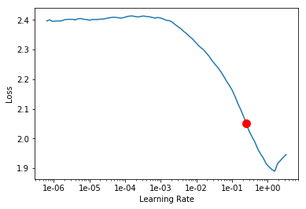
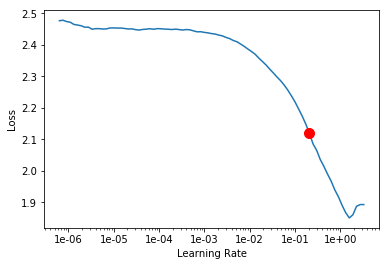

# ResNets


```
%reload_ext autoreload
%autoreload 2
%matplotlib inline

from fastai.vision import *
```

## CNN for MNIST 


```
bs = 
```


```
path = untar_data(URLs.MNIST)
```


```
path.ls()
```


    [PosixPath('/root/.fastai/data/mnist_png/training'),
     PosixPath('/root/.fastai/data/mnist_png/testing')]


```
i1 = ImageList.from_folder(path, convert_mode='L')
```


```
i1.items[0]
```


    PosixPath('/root/.fastai/data/mnist_png/training/8/48092.png')


```
defaults.cmap='binary'
```


```
i1
```


    ImageList (70000 items)
    Image (1, 28, 28),Image (1, 28, 28),Image (1, 28, 28),Image (1, 28, 28),Image (1, 28, 28)
    Path: /root/.fastai/data/mnist_png


```
i1[0].show()
```


```
sd = i1.split_by_folder(train='training', valid='testing')
```

Testing here indicates the validation set (i.e. has the ground truth/labels)


```
sd
```


    ItemLists;
    
    Train: ImageList (60000 items)
    Image (1, 28, 28),Image (1, 28, 28),Image (1, 28, 28),Image (1, 28, 28),Image (1, 28, 28)
    Path: /root/.fastai/data/mnist_png;
    
    Valid: ImageList (10000 items)
    Image (1, 28, 28),Image (1, 28, 28),Image (1, 28, 28),Image (1, 28, 28),Image (1, 28, 28)
    Path: /root/.fastai/data/mnist_png;
    
    Test: None


Folders for each class


```
(path/'training').ls()
```


    [PosixPath('/root/.fastai/data/mnist_png/training/8'),
     PosixPath('/root/.fastai/data/mnist_png/training/7'),
     PosixPath('/root/.fastai/data/mnist_png/training/3'),
     PosixPath('/root/.fastai/data/mnist_png/training/1'),
     PosixPath('/root/.fastai/data/mnist_png/training/6'),
     PosixPath('/root/.fastai/data/mnist_png/training/2'),
     PosixPath('/root/.fastai/data/mnist_png/training/9'),
     PosixPath('/root/.fastai/data/mnist_png/training/4'),
     PosixPath('/root/.fastai/data/mnist_png/training/5'),
     PosixPath('/root/.fastai/data/mnist_png/training/0')]


```
ll = sd.label_from_folder()
```


```
ll
```


    LabelLists;
    
    Train: LabelList (60000 items)
    x: ImageList
    Image (1, 28, 28),Image (1, 28, 28),Image (1, 28, 28),Image (1, 28, 28),Image (1, 28, 28)
    y: CategoryList
    8,8,8,8,8
    Path: /root/.fastai/data/mnist_png;
    
    Valid: LabelList (10000 items)
    x: ImageList
    Image (1, 28, 28),Image (1, 28, 28),Image (1, 28, 28),Image (1, 28, 28),Image (1, 28, 28)
    y: CategoryList
    8,8,8,8,8
    Path: /root/.fastai/data/mnist_png;
    
    Test: None


```
x, y = ll.train[0]
```


```
x.show()
print(y, x.shape)
```

    8 torch.Size([1, 28, 28])


Adding some random padding


```
tfms = ([*rand_pad(padding=3, size=28, mode='zeros')], [])
```


```
ll = ll.transform(tfms)
```


```
bs = 128
```

`.normalize()` grabs data at random and uses its features to normalize 


```
data = ll.databunch(bs=bs).normalize() # Not using imagenet stats
```


```
def _plot(i,j,ax): data.train_ds[0][0].show(ax, cmap='gray')
plot_multi(_plot, 3, 3, figsize=(8,8))
```





> Note : The random padding results in the images of 8 slightly shifting.


```
xb, yb = data.one_batch()
xb.shape, yb.shape
```


    (torch.Size([128, 1, 28, 28]), torch.Size([128]))


```
data.show_batch(rows=3, figsize=(5,5))
```


## Basic ConvNet with batchnorm


```
def conv(ni, nf): return nn.Conv2d(ni, nf, kernel_size=3, stride=2, padding=1)
```

A stride of 2 will lead to a half sized input i.e. 14x14

### CNN Architecture


```
model = nn.Sequential(
    conv(1, 8), # 1 channel in, 8 channels out, returns 8 x 14 x 14 feature map
    nn.BatchNorm2d(8),
    nn.ReLU(),
    conv(8, 16), # 8 channel in, 16 channels out, returns 16 x 7 x 7 feature map
    nn.BatchNorm2d(16),
    nn.ReLU(),
    conv(16, 32), # 16 channel in, 32 channels out, returns 32 x 4 x 4 feature map
    # 4 because math.ceil(7/2) = 4
    nn.BatchNorm2d(32),
    nn.ReLU(),
    conv(32, 16), # 32 channel in, 16 channels out, returns 16 x 2 x 2 feature map
    nn.BatchNorm2d(16),
    nn.ReLU(),
    conv(16, 10), # 16 channels in, 10 channels out, returns 10 x 1 x 1 feature map 
    # i.e. its a tensor of rank 3 [10 x 1 x 1] shape
    nn.BatchNorm2d(10),
    Flatten() # remove (1,1) grid
)
```

- Flatten just removes anu units axes.
- In this case it will convert rank-3 tensor of 10 x 1 x 1 to rank-1 tensor or vector of length 10


```
learn = Learner(data, model, loss_func=nn.CrossEntropyLoss(), metrics=accuracy)
```


```
learn.summary()
```


    Sequential
    ======================================================================
    Layer (type)         Output Shape         Param #    Trainable 
    ======================================================================
    Conv2d               [8, 14, 14]          80         True      
    ______________________________________________________________________
    BatchNorm2d          [8, 14, 14]          16         True      
    ______________________________________________________________________
    ReLU                 [8, 14, 14]          0          False     
    ______________________________________________________________________
    Conv2d               [16, 7, 7]           1,168      True      
    ______________________________________________________________________
    BatchNorm2d          [16, 7, 7]           32         True      
    ______________________________________________________________________
    ReLU                 [16, 7, 7]           0          False     
    ______________________________________________________________________
    Conv2d               [32, 4, 4]           4,640      True      
    ______________________________________________________________________
    BatchNorm2d          [32, 4, 4]           64         True      
    ______________________________________________________________________
    ReLU                 [32, 4, 4]           0          False     
    ______________________________________________________________________
    Conv2d               [16, 2, 2]           4,624      True      
    ______________________________________________________________________
    BatchNorm2d          [16, 2, 2]           32         True      
    ______________________________________________________________________
    ReLU                 [16, 2, 2]           0          False     
    ______________________________________________________________________
    Conv2d               [10, 1, 1]           1,450      True      
    ______________________________________________________________________
    BatchNorm2d          [10, 1, 1]           20         True      
    ______________________________________________________________________
    Flatten              [10]                 0          False     
    ______________________________________________________________________
    
    Total params: 12,126
    Total trainable params: 12,126
    Total non-trainable params: 0
    Optimized with 'torch.optim.adam.Adam', betas=(0.9, 0.99)
    Using true weight decay as discussed in https://www.fast.ai/2018/07/02/adam-weight-decay/ 
    Loss function : CrossEntropyLoss
    ======================================================================
    Callbacks functions applied 


### Sanity check


```
xb = xb.cuda()
```


```
model(xb).shape
```


    torch.Size([128, 10])


```
learn.lr_find(end_lr=100)
```


    LR Finder is complete, type {learner_name}.recorder.plot() to see the graph.


```
learn.recorder.plot(suggestion=True)
```

    Min numerical gradient: 2.00E-01
    Min loss divided by 10: 1.02E+00


Selecting initial lr as **1e-01**


```
learn.fit_one_cycle(3, max_lr=0.1)
```


<table border="1" class="dataframe">
  <thead>
    <tr style="text-align: left;">
      <th>epoch</th>
      <th>train_loss</th>
      <th>valid_loss</th>
      <th>accuracy</th>
      <th>time</th>
    </tr>
  </thead>
  <tbody>
    <tr>
      <td>0</td>
      <td>0.227289</td>
      <td>0.174879</td>
      <td>0.944500</td>
      <td>00:28</td>
    </tr>
    <tr>
      <td>1</td>
      <td>0.134290</td>
      <td>0.083074</td>
      <td>0.975100</td>
      <td>00:28</td>
    </tr>
    <tr>
      <td>2</td>
      <td>0.071327</td>
      <td>0.045820</td>
      <td>0.985600</td>
      <td>00:27</td>
    </tr>
  </tbody>
</table>


```

```

> Accuracy : 98.6%

## Refactor

`conv_layer` in fastai has the conv2d batchnorm and ReLU combination in-built


```
def conv2(ni, nf): return conv_layer(ni, nf, stride=2)
```


```
model = nn.Sequential(
    conv2(1, 8),   # 14
    conv2(8, 16),  # 7
    conv2(16, 32), # 4
    conv2(32, 16), # 2
    conv2(16, 10), # 1
    Flatten()      # remove (1,1) grid
)
```


```
learn = Learner(data, model, loss_func=nn.CrossEntropyLoss(), metrics=accuracy)
```


```
learn.summary()
```


    Sequential
    ======================================================================
    Layer (type)         Output Shape         Param #    Trainable 
    ======================================================================
    Conv2d               [8, 14, 14]          72         True      
    ______________________________________________________________________
    ReLU                 [8, 14, 14]          0          False     
    ______________________________________________________________________
    BatchNorm2d          [8, 14, 14]          16         True      
    ______________________________________________________________________
    Conv2d               [16, 7, 7]           1,152      True      
    ______________________________________________________________________
    ReLU                 [16, 7, 7]           0          False     
    ______________________________________________________________________
    BatchNorm2d          [16, 7, 7]           32         True      
    ______________________________________________________________________
    Conv2d               [32, 4, 4]           4,608      True      
    ______________________________________________________________________
    ReLU                 [32, 4, 4]           0          False     
    ______________________________________________________________________
    BatchNorm2d          [32, 4, 4]           64         True      
    ______________________________________________________________________
    Conv2d               [16, 2, 2]           4,608      True      
    ______________________________________________________________________
    ReLU                 [16, 2, 2]           0          False     
    ______________________________________________________________________
    BatchNorm2d          [16, 2, 2]           32         True      
    ______________________________________________________________________
    Conv2d               [10, 1, 1]           1,440      True      
    ______________________________________________________________________
    ReLU                 [10, 1, 1]           0          False     
    ______________________________________________________________________
    BatchNorm2d          [10, 1, 1]           20         True      
    ______________________________________________________________________
    Flatten              [10]                 0          False     
    ______________________________________________________________________
    
    Total params: 12,044
    Total trainable params: 12,044
    Total non-trainable params: 0
    Optimized with 'torch.optim.adam.Adam', betas=(0.9, 0.99)
    Using true weight decay as discussed in https://www.fast.ai/2018/07/02/adam-weight-decay/ 
    Loss function : CrossEntropyLoss
    ======================================================================
    Callbacks functions applied 


Exactly the same architecture as before.


```
learn.lr_find()
```


    LR Finder is complete, type {learner_name}.recorder.plot() to see the graph.


```
learn.recorder.plot(suggestion=True)
```

    Min numerical gradient: 2.51E-01
    Min loss divided by 10: 1.58E-01





```
learn.fit_one_cycle(10, max_lr=1e-01)
```


<table border="1" class="dataframe">
  <thead>
    <tr style="text-align: left;">
      <th>epoch</th>
      <th>train_loss</th>
      <th>valid_loss</th>
      <th>accuracy</th>
      <th>time</th>
    </tr>
  </thead>
  <tbody>
    <tr>
      <td>0</td>
      <td>0.227982</td>
      <td>0.141141</td>
      <td>0.955600</td>
      <td>00:27</td>
    </tr>
    <tr>
      <td>1</td>
      <td>0.187402</td>
      <td>0.291858</td>
      <td>0.905400</td>
      <td>00:27</td>
    </tr>
    <tr>
      <td>2</td>
      <td>0.160548</td>
      <td>0.165445</td>
      <td>0.952800</td>
      <td>00:27</td>
    </tr>
    <tr>
      <td>3</td>
      <td>0.122353</td>
      <td>0.138911</td>
      <td>0.958200</td>
      <td>00:27</td>
    </tr>
    <tr>
      <td>4</td>
      <td>0.123963</td>
      <td>0.145013</td>
      <td>0.955800</td>
      <td>00:27</td>
    </tr>
    <tr>
      <td>5</td>
      <td>0.100189</td>
      <td>0.077624</td>
      <td>0.976400</td>
      <td>00:27</td>
    </tr>
    <tr>
      <td>6</td>
      <td>0.086437</td>
      <td>0.050799</td>
      <td>0.982900</td>
      <td>00:27</td>
    </tr>
    <tr>
      <td>7</td>
      <td>0.065064</td>
      <td>0.041983</td>
      <td>0.986000</td>
      <td>00:27</td>
    </tr>
    <tr>
      <td>8</td>
      <td>0.045680</td>
      <td>0.032509</td>
      <td>0.989300</td>
      <td>00:27</td>
    </tr>
    <tr>
      <td>9</td>
      <td>0.045259</td>
      <td>0.030866</td>
      <td>0.989600</td>
      <td>00:27</td>
    </tr>
  </tbody>
</table>


## ResNet

In order to build a deeper CNN network, we can
- Simply add a stride 1 conv after stride 2 conv, since a stride 1 conv does not change the size of the feature map (whereas in the case of stride 2, it halves the size)

From Microsoft Research,
- **Deep Residual Learning for Image Recognition** : https://arxiv.org/abs/1512.03385
- Looking at the training error for CIFAR10, 56 layer vs 20 layer networks
- 56 layer one has a lot more params 
- The expectation with the 56 layer network was that it would seriously overfit
- But that did not happen. It performed had worse training error
- Every 2 convolutions, add together the input to the 2 convs
- So instead of,
$$output=C2(C1(x))$$
- They went 
$$output=x+C2(C1(x))$$
- They added the identity connections or skip connections
- ResBlocks! Adding ResBlocks to standard CNNs almost always leads to better performance
- Visualizing loss landscapes : https://arxiv.org/abs/1712.09913


```
class ResBlock(nn.Module):
    def __init__(self, nf):
        super.__init__()
        self.conv1 = conv_layer(nf, nf)
        self.conv2 = conv_layer(nf, nf)
    
    def forward(self, x): 
        return x + self.conv2(self.conv1(x))
```


```
help(res_block)
```

    Help on function res_block in module fastai.layers:
    
    res_block(nf, dense:bool=False, norm_type:Union[fastai.layers.NormType, NoneType]=<NormType.Batch: 1>, bottle:bool=False, **conv_kwargs)
        Resnet block of `nf` features. `conv_kwargs` are passed to `conv_layer`.
    


With ResBlock


```
model = nn.Sequential(
    conv2(1, 8),   # 14
    res_block(8),
    conv2(8, 16),  # 7
    res_block(16),
    conv2(16, 32), # 4
    res_block(32),
    conv2(32, 16), # 2
    res_block(16),
    conv2(16, 10), # 1
    Flatten()      # remove (1,1) grid
)
```

Refactoring again


```
def conv_and_res(ni, nf): return nn.Sequential(conv2(ni, nf), res_block(nf))
```


```
model = nn.Sequential(
    conv_and_res(1, 8),   # 14
    conv_and_res(8, 16),  # 7
    conv_and_res(16, 32), # 4
    conv_and_res(32, 16), # 2
    conv2(16, 10), # 1
    Flatten()      # remove (1,1) grid
)
```

> Note : Always keep refactoring to keep errors at bay!


```
learn = Learner(data, model, loss_func=nn.CrossEntropyLoss(), metrics=accuracy)
```


```
learn.summary()
```


    Sequential
    ======================================================================
    Layer (type)         Output Shape         Param #    Trainable 
    ======================================================================
    Conv2d               [8, 14, 14]          72         True      
    ______________________________________________________________________
    ReLU                 [8, 14, 14]          0          False     
    ______________________________________________________________________
    BatchNorm2d          [8, 14, 14]          16         True      
    ______________________________________________________________________
    Conv2d               [8, 14, 14]          576        True      
    ______________________________________________________________________
    ReLU                 [8, 14, 14]          0          False     
    ______________________________________________________________________
    BatchNorm2d          [8, 14, 14]          16         True      
    ______________________________________________________________________
    Conv2d               [8, 14, 14]          576        True      
    ______________________________________________________________________
    ReLU                 [8, 14, 14]          0          False     
    ______________________________________________________________________
    BatchNorm2d          [8, 14, 14]          16         True      
    ______________________________________________________________________
    MergeLayer           [8, 14, 14]          0          False     
    ______________________________________________________________________
    Conv2d               [16, 7, 7]           1,152      True      
    ______________________________________________________________________
    ReLU                 [16, 7, 7]           0          False     
    ______________________________________________________________________
    BatchNorm2d          [16, 7, 7]           32         True      
    ______________________________________________________________________
    Conv2d               [16, 7, 7]           2,304      True      
    ______________________________________________________________________
    ReLU                 [16, 7, 7]           0          False     
    ______________________________________________________________________
    BatchNorm2d          [16, 7, 7]           32         True      
    ______________________________________________________________________
    Conv2d               [16, 7, 7]           2,304      True      
    ______________________________________________________________________
    ReLU                 [16, 7, 7]           0          False     
    ______________________________________________________________________
    BatchNorm2d          [16, 7, 7]           32         True      
    ______________________________________________________________________
    MergeLayer           [16, 7, 7]           0          False     
    ______________________________________________________________________
    Conv2d               [32, 4, 4]           4,608      True      
    ______________________________________________________________________
    ReLU                 [32, 4, 4]           0          False     
    ______________________________________________________________________
    BatchNorm2d          [32, 4, 4]           64         True      
    ______________________________________________________________________
    Conv2d               [32, 4, 4]           9,216      True      
    ______________________________________________________________________
    ReLU                 [32, 4, 4]           0          False     
    ______________________________________________________________________
    BatchNorm2d          [32, 4, 4]           64         True      
    ______________________________________________________________________
    Conv2d               [32, 4, 4]           9,216      True      
    ______________________________________________________________________
    ReLU                 [32, 4, 4]           0          False     
    ______________________________________________________________________
    BatchNorm2d          [32, 4, 4]           64         True      
    ______________________________________________________________________
    MergeLayer           [32, 4, 4]           0          False     
    ______________________________________________________________________
    Conv2d               [16, 2, 2]           4,608      True      
    ______________________________________________________________________
    ReLU                 [16, 2, 2]           0          False     
    ______________________________________________________________________
    BatchNorm2d          [16, 2, 2]           32         True      
    ______________________________________________________________________
    Conv2d               [16, 2, 2]           2,304      True      
    ______________________________________________________________________
    ReLU                 [16, 2, 2]           0          False     
    ______________________________________________________________________
    BatchNorm2d          [16, 2, 2]           32         True      
    ______________________________________________________________________
    Conv2d               [16, 2, 2]           2,304      True      
    ______________________________________________________________________
    ReLU                 [16, 2, 2]           0          False     
    ______________________________________________________________________
    BatchNorm2d          [16, 2, 2]           32         True      
    ______________________________________________________________________
    MergeLayer           [16, 2, 2]           0          False     
    ______________________________________________________________________
    Conv2d               [10, 1, 1]           1,440      True      
    ______________________________________________________________________
    ReLU                 [10, 1, 1]           0          False     
    ______________________________________________________________________
    BatchNorm2d          [10, 1, 1]           20         True      
    ______________________________________________________________________
    Flatten              [10]                 0          False     
    ______________________________________________________________________
    
    Total params: 41,132
    Total trainable params: 41,132
    Total non-trainable params: 0
    Optimized with 'torch.optim.adam.Adam', betas=(0.9, 0.99)
    Using true weight decay as discussed in https://www.fast.ai/2018/07/02/adam-weight-decay/ 
    Loss function : CrossEntropyLoss
    ======================================================================
    Callbacks functions applied 


```
learn.lr_find()
```


    LR Finder is complete, type {learner_name}.recorder.plot() to see the graph.


```
learn.recorder.plot(suggestion=True)
```

    Min numerical gradient: 2.09E-01
    Min loss divided by 10: 1.58E-01





```
learn.fit_one_cycle(12, max_lr=5e-2)
```


<table border="1" class="dataframe">
  <thead>
    <tr style="text-align: left;">
      <th>epoch</th>
      <th>train_loss</th>
      <th>valid_loss</th>
      <th>accuracy</th>
      <th>time</th>
    </tr>
  </thead>
  <tbody>
    <tr>
      <td>0</td>
      <td>0.257022</td>
      <td>0.184213</td>
      <td>0.951200</td>
      <td>00:30</td>
    </tr>
    <tr>
      <td>1</td>
      <td>0.132965</td>
      <td>0.102803</td>
      <td>0.970500</td>
      <td>00:29</td>
    </tr>
    <tr>
      <td>2</td>
      <td>0.108540</td>
      <td>0.092987</td>
      <td>0.971900</td>
      <td>00:29</td>
    </tr>
    <tr>
      <td>3</td>
      <td>0.095469</td>
      <td>0.095387</td>
      <td>0.969600</td>
      <td>00:29</td>
    </tr>
    <tr>
      <td>4</td>
      <td>0.066686</td>
      <td>0.053341</td>
      <td>0.983000</td>
      <td>00:29</td>
    </tr>
    <tr>
      <td>5</td>
      <td>0.064911</td>
      <td>0.113114</td>
      <td>0.962700</td>
      <td>00:29</td>
    </tr>
    <tr>
      <td>6</td>
      <td>0.056524</td>
      <td>0.035624</td>
      <td>0.988000</td>
      <td>00:29</td>
    </tr>
    <tr>
      <td>7</td>
      <td>0.040790</td>
      <td>0.025054</td>
      <td>0.991200</td>
      <td>00:29</td>
    </tr>
    <tr>
      <td>8</td>
      <td>0.036685</td>
      <td>0.023885</td>
      <td>0.992100</td>
      <td>00:30</td>
    </tr>
    <tr>
      <td>9</td>
      <td>0.025595</td>
      <td>0.022459</td>
      <td>0.992800</td>
      <td>00:29</td>
    </tr>
    <tr>
      <td>10</td>
      <td>0.020561</td>
      <td>0.015673</td>
      <td>0.994800</td>
      <td>00:29</td>
    </tr>
    <tr>
      <td>11</td>
      <td>0.018739</td>
      <td>0.016082</td>
      <td>0.994600</td>
      <td>00:29</td>
    </tr>
  </tbody>
</table>


## DenseNet

- If we use concatenate instead of addition, we get a dense block.
- DenseNet can be memory intensive
- Very few parameters
- Tend to work very well with small datasets
- Contains all the original pixels
